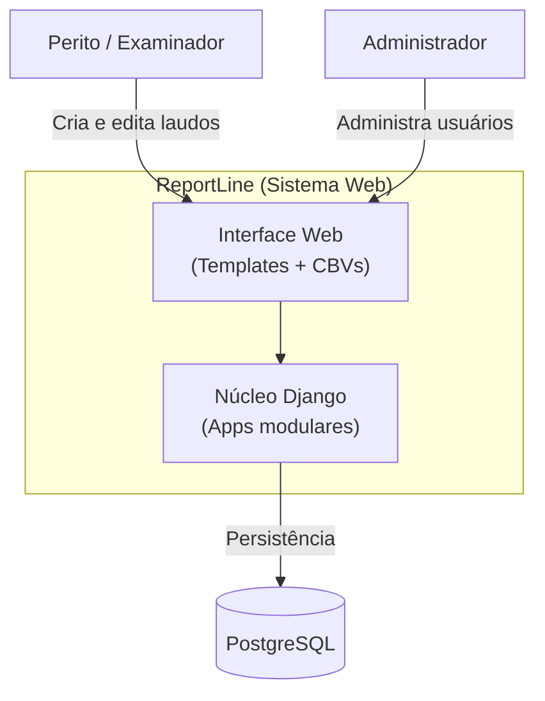
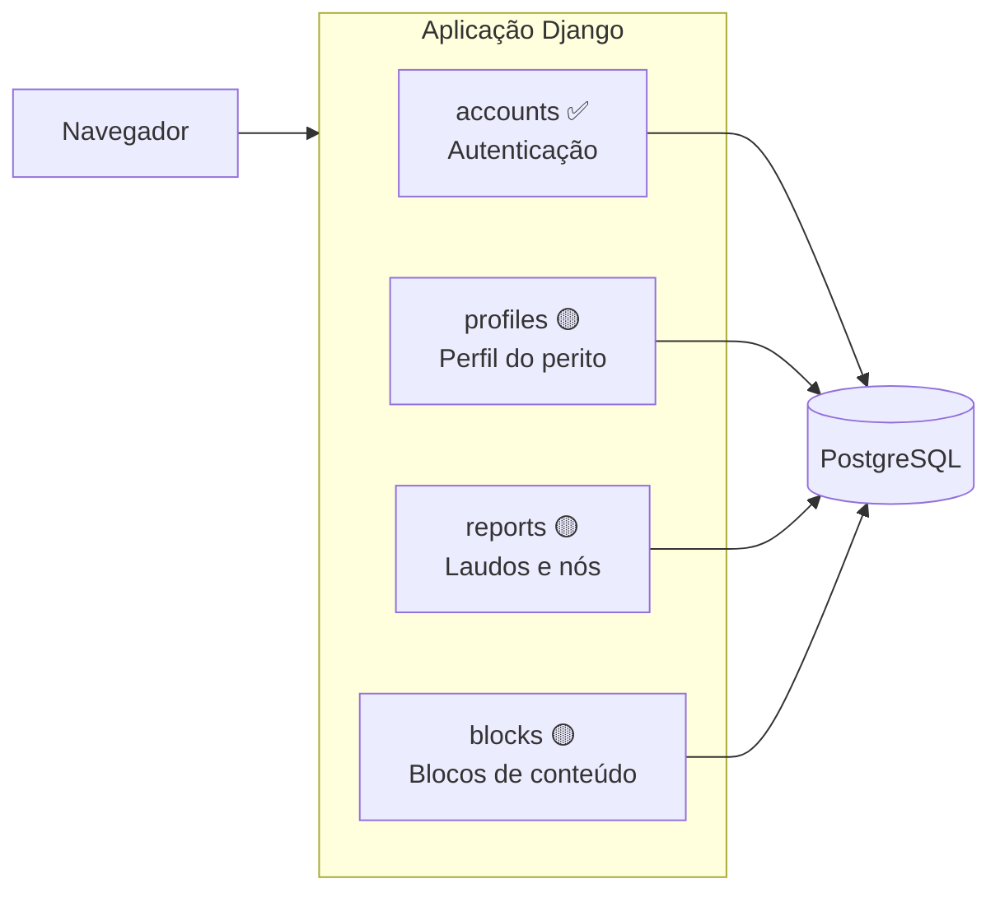

# Contexto do Sistema

Visão de alto nível do ReportLine: propósito, atores e containers principais.

## Propósito

O **ReportLine** é um sistema web para gestão e produção automatizada de laudos
e relatórios periciais/forenses. Substitui edição manual fragmentada por uma
estrutura dinâmica, modular e centralizada.

## Atores

| Ator | Descrição |
|---|---|
| **Perito / Examinador** | Usuário autenticado que cria, edita e publica laudos |
| **Administrador** | Gerencia usuários, permissões e configurações via Django Admin |

## Diagrama de contexto (C4 — Nível 1)

## Containers (C4 — Nível 2)

## Estado atual vs. alvo

| Container | Status | Observação |
|---|---|---|
| `accounts` | ✅ Implementado | `CustomUser` com UUID, login placeholder; **alvo institucional: gov.br** (ver ADR-0003) |
| `profiles` | 🟡 Planejado | Perfil 1:1 com usuário |
| `reports` | 🟡 Planejado | Laudo composto por árvore de nós |
| `blocks` | 🟡 Planejado | Conteúdo reutilizável por nó |

## Referências

- [Modelo de dados](./02-data-model.md)
- [Mapa de apps](./03-apps-map.md)
- [ADR-0001: CustomUser com UUID](../decisions/0001-custom-user-uuid.md)
- [ADR-0002: Estrutura de laudo modular](../decisions/0002-report-node-structure.md)
- [ADR-0003: Autenticação gov.br (institucional)](../decisions/0003-govbr-authentication.md)
