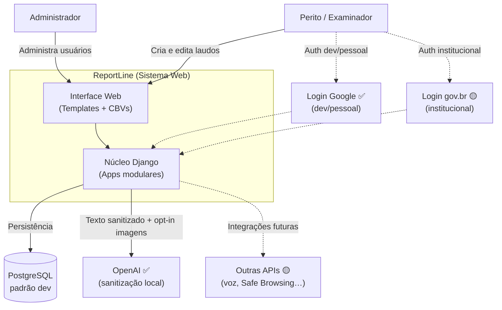
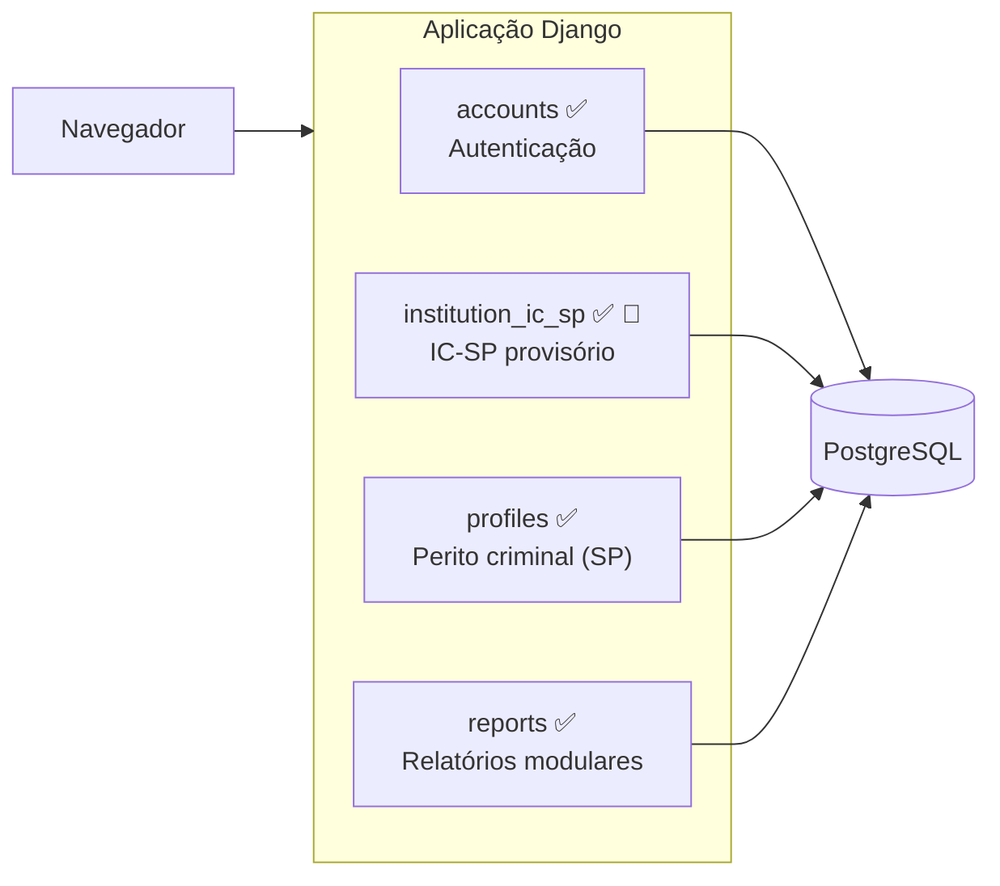

# reportline/docs/architecture/01-context.md
# Contexto do Sistema

Visão de alto nível do ReportLine: propósito, atores e containers principais.

## Propósito

O **ReportLine** é um sistema web para gestão e produção automatizada de laudos
e relatórios periciais/forenses. Substitui edição manual fragmentada por uma
estrutura dinâmica, modular e centralizada.

## Atores

| Ator | Descrição |
|---|---|
| **Perito / Examinador** | Usuário autenticado que cria, edita e publica laudos |
| **Administrador** | Gerencia usuários, permissões e configurações via Django Admin |

## Diagrama de contexto (C4 — Nível 1)

> **Nota:** PostgreSQL é o SGBD padrão em desenvolvimento ([ADR-0004](../decisions/0004-postgresql-sgbd.md)).
> Login Google (fase 1) está implementado para dev e deploy pessoal; gov.br é alvo
> institucional ([ADR-0003](../decisions/0003-govbr-authentication.md)).
> Integração com **OpenAI** está ativa no módulo de laudo pericial, com
> sanitização local de PII antes do envio ([ADR-0008](../decisions/0008-ai-pii-sanitization.md),
> [09-forensic-ai-privacy.md](./09-forensic-ai-privacy.md)); credenciais seguem
> [ADR-0005](../decisions/0005-external-api-credentials.md).

## Containers (C4 — Nível 2)

## Persistência (SGBD)

O ReportLine adota **PostgreSQL** como SGBD padrão em desenvolvimento e
documentação. Em ambiente **institucional**, a instituição adotante pode
utilizar **outro SGBD a seu critério**, desde que compatível com Django ORM
(ver [ADR-0004](../decisions/0004-postgresql-sgbd.md)).

### Arquivos de mídia (uploads)

Além do banco relacional, o ReportLine usa **`MEDIA_ROOT`** para arquivos
enviados pelo usuário ou pelo admin (ex.: logos institucionais no cabeçalho
do laudo). Essa pasta **não é versionada no Git** (`.gitignore`).

Em **produção**, quem hospeda o sistema deve:

- manter `MEDIA_ROOT` em disco persistente ou storage externo;
- servir `/media/` via reverse proxy ou CDN (não via Django);
- incluir mídia nos backups e repor uploads após deploy em servidor novo.

Detalhes operacionais e checklist de deploy:
[04-institution-ic-sp.md — Logos e mídia no deploy](./04-institution-ic-sp.md#logos-e-mídia-no-deploy).

## Integrações externas (APIs)

| Integração | Status | Observação |
|---|---|---|
| **OpenAI** (laudo pericial) | ✅ | Extração administrativa e redação assistida; texto sanitizado localmente antes do envio ([ADR-0008](../decisions/0008-ai-pii-sanitization.md)) |
| **Google OAuth** (login) | ✅ | Dev/pessoal — fase 1 ([ADR-0003](../decisions/0003-govbr-authentication.md)) |
| **Google Cloud STT** (ditado) | 🟡 | Variáveis em `.env.example`; service account em `var/secrets/` |
| **Google Safe Browsing** | 🟡 | Moderação de links no editor |
| **gov.br OIDC** | 🟡 | Alvo institucional |

Na fase de **desenvolvimento**, credenciais **pessoais** via `.env` (fora do Git).
Em ambiente **institucional**, chaves **institucionais** geridas pelo órgão
([ADR-0005](../decisions/0005-external-api-credentials.md)).

Setup de IA e sanitização: [09-forensic-ai-privacy.md](./09-forensic-ai-privacy.md).

## Estado atual vs. alvo

| Container | Status | Observação |
|---|---|---|
| `accounts` | ✅ Implementado | `CustomUser` (UUID, OAuth), login Google (fase 1) + local staff; alvo institucional: gov.br ([ADR-0003](../decisions/0003-govbr-authentication.md)) |
| `institution_ic_sp` | ✅ Implementado 🔵 | Núcleos/equipes IC-SP + módulo `forensic_report` (intake, bootstrap, IA); **substituível** em produção (ADR-0006) |
| `profiles` | ✅ Implementado | `ForensicExaminerSP` 1:1 com user, lotação, permissão de imagens à IA (ADR-0007) |
| `reports` | ✅ Implementado | Editor completo; preview paginado e export PDF Playwright ([07-reports.md](./07-reports.md), [08-report-document-render.md](./08-report-document-render.md), [runbook_pdf.md](../runbook_pdf.md)) |
| `common` (privacidade) | ✅ Implementado | Sanitização PII + `AiSanitizationAudit` (ADR-0008) |

## Referências

- [Modelo de dados](./02-data-model.md)
- [Mapa de apps](./03-apps-map.md)
- [ADR-0001: CustomUser com UUID](../decisions/0001-custom-user-uuid.md)
- [ADR-0002: Estrutura de laudo modular](../decisions/0002-report-node-structure.md)
- [ADR-0003: Autenticação em fases (local → Google → gov.br)](../decisions/0003-govbr-authentication.md)
- [ADR-0004: PostgreSQL como SGBD padrão](../decisions/0004-postgresql-sgbd.md)
- [ADR-0005: Credenciais de APIs externas](../decisions/0005-external-api-credentials.md)
- [ADR-0006: App provisório IC-SP](../decisions/0006-provisional-institution-ic-sp.md)
- [ADR-0007: ForensicExaminerSP](../decisions/0007-forensic-examiner-sp.md)
- [ADR-0008: Sanitização PII antes de IA externa](../decisions/0008-ai-pii-sanitization.md)
- [IA externa e privacidade](./09-forensic-ai-privacy.md)
- [App profiles](./05-profiles.md)
- [App reports](./07-reports.md)
