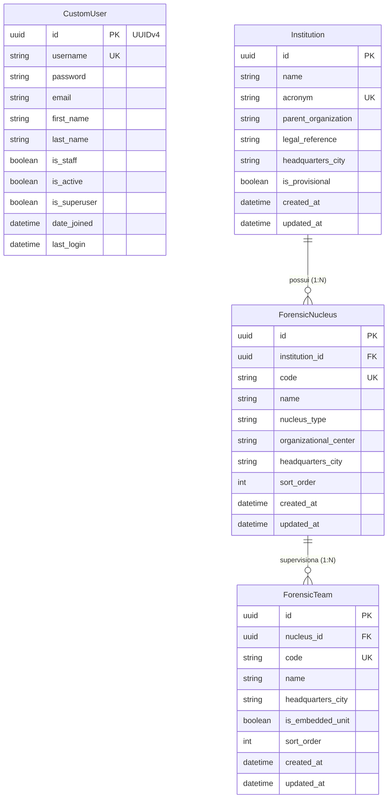
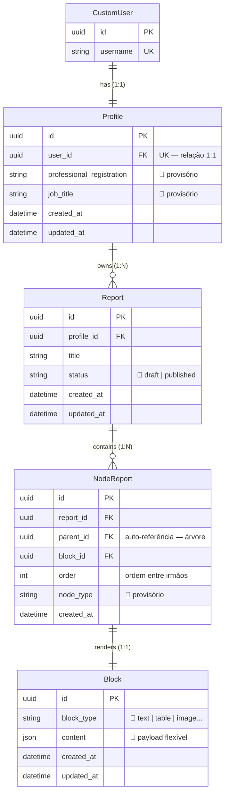

# Modelo de Dados (ERD)

Relacionamentos entre entidades do domínio ReportLine.

> **Nota:** nomes marcados com 🔵 são provisórios. Consulte os ADRs antes de
> implementar.
>
> **SGBD:** PostgreSQL é o padrão do projeto; em ambiente institucional, outro
> SGBD pode ser adotado a critério da instituição ([ADR-0004](../decisions/0004-postgresql-sgbd.md)).

---

## Estado atual ✅

Autenticação e cadastro institucional provisório do IC-SP estão implementados.

| App | Models | Decisão |
|---|---|---|
| `accounts` | `CustomUser` | [ADR-0001](../decisions/0001-custom-user-uuid.md) |
| `institution_ic_sp` | `Institution`, `ForensicNucleus`, `ForensicTeam` | [ADR-0006](../decisions/0006-provisional-institution-ic-sp.md) |

Em ambiente **institucional**, a autenticação dos peritos migrará para Login
**gov.br** (OIDC), com possível extensão do model para CPF/`sub` OIDC — ver
[ADR-0003](../decisions/0003-govbr-authentication.md).

### Dados institucionais (IC-SP) 🔵

Cadastro **provisório** espelhando o organograma da SPTC. Detalhes em
[04-institution-ic-sp.md](./04-institution-ic-sp.md).

| Entidade | Registros seed | Descrição |
|---|---|---|
| `Institution` | 1 | IC-SP (`is_provisional=True`) |
| `ForensicNucleus` | 29 | Núcleos especializados, regionais e de apoio |
| `ForensicTeam` | 59 | 17 capital/GSP + 40 interior + 2 apoio logístico |

---

## Estado alvo 🟡

Estrutura prevista para laudos modulares, inspirada conceitualmente no projeto
**Pith** (árvore de nós + blocos de conteúdo), com adaptações ao domínio forense
do ReportLine.

### Cardinalidades

| Relação | Tipo | Descrição |
|---|---|---|
| `CustomUser` → `Profile` | 1:1 | Cada usuário tem exatamente um perfil profissional |
| `Profile` → `Report` | 1:N | Um perito possui vários laudos |
| `Report` → `NodeReport` | 1:N | Um laudo é composto por vários nós |
| `NodeReport` → `Block` | 1:1 | Cada nó referencia um bloco de conteúdo |
| `NodeReport` → `NodeReport` | 1:N | Hierarquia (pai → filhos) para seções aninhadas |

### Observações de modelagem

1. **`NodeReport` como árvore:** além do FK para `Report`, prevê `parent_id`
   (auto-referência) para seções e subseções — padrão similar ao Pith.
2. **`Block` desacoplado:** permite reutilizar tipos de conteúdo e evoluir
   o payload (`JSONField`) sem reestruturar a árvore.
3. **UUID em todas as PKs:** alinhado à decisão do `CustomUser` (ADR-0001).
4. **Nomes provisórios:** `Profile`, `Report`, `NodeReport`, `Block` podem
   ser renomeados — ver [ADR-0002](../decisions/0002-report-node-structure.md).

---

## Mapa entidade → app (previsto)

| Entidade | App Django | Status |
|---|---|---|
| `CustomUser` | `accounts` | ✅ |
| `Institution` | `institution_ic_sp` | ✅ 🔵 provisório |
| `ForensicNucleus` | `institution_ic_sp` | ✅ 🔵 provisório |
| `ForensicTeam` | `institution_ic_sp` | ✅ 🔵 provisório |
| `Profile` | `profiles` | 🟡 |
| `Report` | `reports` | 🟡 |
| `NodeReport` | `reports` | 🟡 |
| `Block` | `blocks` | 🟡 |

---

## Próximos passos de documentação

- [x] Atualizar seção **Estado atual** ao implementar `institution_ic_sp`
- [ ] Atualizar seção **Estado atual** ao implementar `Profile`
- [ ] Documentar fluxo de criação de laudo em `04-flows/create-report.md`
- [ ] Complementar com ERD gerado automaticamente quando models existirem

## Referências

- [Contexto do sistema](./01-context.md)
- [Mapa de apps](./03-apps-map.md)
- [ADR-0001: CustomUser com UUID](../decisions/0001-custom-user-uuid.md)
- [ADR-0002: Estrutura de laudo modular](../decisions/0002-report-node-structure.md)
- [ADR-0003: Autenticação gov.br (institucional)](../decisions/0003-govbr-authentication.md)
- [ADR-0004: PostgreSQL como SGBD padrão](../decisions/0004-postgresql-sgbd.md)
- [ADR-0005: Credenciais de APIs externas](../decisions/0005-external-api-credentials.md)
- [ADR-0006: App provisório IC-SP](../decisions/0006-provisional-institution-ic-sp.md)
- [App institution_ic_sp](./04-institution-ic-sp.md)
