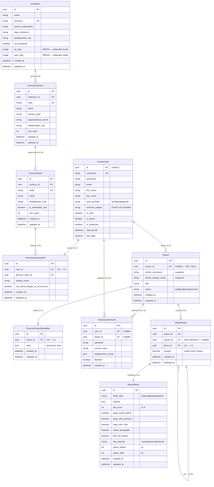

# Modelo de Dados (ERD)

Relacionamentos entre entidades do domínio ReportLine.

> **SGBD:** PostgreSQL é o padrão do projeto; em ambiente institucional, outro
> SGBD pode ser adotado a critério da instituição ([ADR-0004](../decisions/0004-postgresql-sgbd.md)).

---

## Estado atual ✅

Autenticação, cadastro institucional provisório do IC-SP, perfil do perito
criminal (SP) e **relatórios modulares genéricos** estão implementados.

| App | Models | Decisão |
|---|---|---|
| `accounts` | `CustomUser` | [ADR-0001](../decisions/0001-custom-user-uuid.md) |
| `common` | `BaseModel`, `AiSanitizationAudit` | [ADR-0008](../decisions/0008-ai-pii-sanitization.md) |
| `institution_ic_sp` | `Institution`, `ForensicNucleus`, `ForensicTeam`, `ForensicReportMetadata` | [ADR-0006](../decisions/0006-provisional-institution-ic-sp.md) |
| `profiles` | `ForensicExaminerSP` | [ADR-0007](../decisions/0007-forensic-examiner-sp.md) |
| `reports` | `Report`, `ReportNode`, `ReportBlock` | [ADR-0002](../decisions/0002-report-node-structure.md) |

Documentação detalhada do app: [07-reports.md](./07-reports.md).

### Cardinalidades — relatórios

| Relação | Tipo | Descrição |
|---|---|---|
| `CustomUser` → `Report` | 1:N | Um usuário produz vários relatórios |
| `Report` → `ReportNode` | 1:N | Um relatório é composto por vários nós |
| `ReportNode` → `ReportBlock` | 1:1 | Cada nó referencia um bloco de conteúdo |
| `ReportNode` → `ReportNode` | 1:N | Hierarquia (pai → filhos) para seções aninhadas |

### Observações de modelagem — relatórios

1. **`ReportNode` como árvore:** FK `parent` (auto-referência) + `position` decimal
   (indexação fracionária entre irmãos).
2. **`ReportBlock` no mesmo app:** blocos genéricos não são compartilhados entre
   relatórios; cada nó possui seu bloco exclusivo.
3. **Autor com snapshot:** exclusão de `CustomUser` desvincula o FK (`SET_NULL`)
   e preserva `author_username` / `author_display_name`.
4. **UUID em todas as PKs:** alinhado à decisão do `CustomUser` (ADR-0001).

Em ambiente **institucional**, a autenticação dos peritos migrará para Login
**gov.br** (OIDC) — ver [ADR-0003](../decisions/0003-govbr-authentication.md).

### Dados institucionais (IC-SP) 🔵

Cadastro **provisório** espelhando o organograma da SPTC. Detalhes em
[04-institution-ic-sp.md](./04-institution-ic-sp.md).

| Entidade | Registros seed | Descrição |
|---|---|---|
| `Institution` | 1 | IC-SP (`is_provisional=True`); logos opcionais em `MEDIA_ROOT` |
| `ForensicNucleus` | 29 | Núcleos especializados, regionais e de apoio |
| `ForensicTeam` | 59 | 17 capital/GSP + 40 interior + 2 apoio logístico |

### Perfil do perito (SP)

Detalhes em [05-profiles.md](./05-profiles.md).

| Entidade | Descrição |
|---|---|
| `ForensicExaminerSP` | Perfil 1:1 com `CustomUser`; lotação N:1 em `ForensicTeam`; `display_name`; permissão de imagens à IA |
| `ForensicReportMetadata` | Dossiê 1:1 com `Report`; metadados confirmados por fase (`initial_data`, `property_crime`, …) |
| `AiSanitizationAudit` | Hash e contadores de sanitização pré-envio à OpenAI; sem texto bruto |

Detalhes de IA e privacidade: [09-forensic-ai-privacy.md](./09-forensic-ai-privacy.md).

---

## Estado alvo 🟡

Camada de **laudo pericial específico** sobre a estrutura genérica de relatórios
— parcialmente implementada em `institution_ic_sp/forensic_report/`.

| Item | Descrição | Status |
|---|---|---|
| Intake e bootstrap pericial | Upload, extração administrativa, confirmação do perito | ✅ |
| Dossiê por fase | `ForensicReportMetadata` após confirmação | ✅ |
| Fluxo exame de local (property crime) | Características do local assistidas por IA | ✅ |
| Sanitização PII antes da OpenAI | Gateway único + auditoria | ✅ ([ADR-0008](../decisions/0008-ai-pii-sanitization.md)) |
| Templates de laudo | Mapeamento semântico completo | 🟡 |
| Editor web | CBVs de criação/edição da árvore de nós | 🟡 |
| Renderização | PDF/HTML interpretando `ReportBlock` e opções de layout | ✅ (preview + PDF; KaTeX pendente) |
| Versionamento | Imutabilidade de blocos após publicação | 🟡 em discussão |

A decisão de **não** separar app `blocks` na fase inicial está registrada no
[ADR-0002](../decisions/0002-report-node-structure.md). Reutilização de blocos
entre laudos pode ser reavaliada quando templates institucionais exigirem.

---

## Mapa entidade → app

| Entidade | App Django | Status |
|---|---|---|
| `CustomUser` | `accounts` | ✅ |
| `Institution` | `institution_ic_sp` | ✅ 🔵 provisório |
| `ForensicNucleus` | `institution_ic_sp` | ✅ 🔵 provisório |
| `ForensicTeam` | `institution_ic_sp` | ✅ 🔵 provisório |
| `ForensicExaminerSP` | `profiles` | ✅ |
| `ForensicReportMetadata` | `institution_ic_sp` | ✅ |
| `AiSanitizationAudit` | `common` | ✅ |
| `Report` | `reports` | ✅ |
| `ReportNode` | `reports` | ✅ |
| `ReportBlock` | `reports` | ✅ |

---

## Próximos passos de documentação

- [x] Atualizar seção **Estado atual** ao implementar `institution_ic_sp`
- [x] Atualizar seção **Estado atual** ao implementar `ForensicExaminerSP`
- [x] Atualizar seção **Estado atual** ao implementar `reports`
- [x] Documentar app `reports` em [07-reports.md](./07-reports.md)
- [x] Documentar fluxo completo do app `reports` em [07-reports.md](./07-reports.md) (listagem, criação, editor, API, home)
- [ ] Extrair fluxo detalhado para `04-flows/create-report.md` (opcional)
- [ ] Complementar com ERD gerado automaticamente (opcional, futuro)

## Referências

- [Contexto do sistema](./01-context.md)
- [Mapa de apps](./03-apps-map.md)
- [App reports](./07-reports.md)
- [ADR-0001: CustomUser com UUID](../decisions/0001-custom-user-uuid.md)
- [ADR-0002: Estrutura de laudo modular](../decisions/0002-report-node-structure.md)
- [ADR-0003: Autenticação gov.br (institucional)](../decisions/0003-govbr-authentication.md)
- [ADR-0004: PostgreSQL como SGBD padrão](../decisions/0004-postgresql-sgbd.md)
- [ADR-0005: Credenciais de APIs externas](../decisions/0005-external-api-credentials.md)
- [ADR-0006: App provisório IC-SP](../decisions/0006-provisional-institution-ic-sp.md)
- [ADR-0007: ForensicExaminerSP](../decisions/0007-forensic-examiner-sp.md)
- [ADR-0008: Sanitização PII antes de IA externa](../decisions/0008-ai-pii-sanitization.md)
- [09-forensic-ai-privacy.md](./09-forensic-ai-privacy.md)
- [App institution_ic_sp](./04-institution-ic-sp.md)
- [App profiles](./05-profiles.md)
