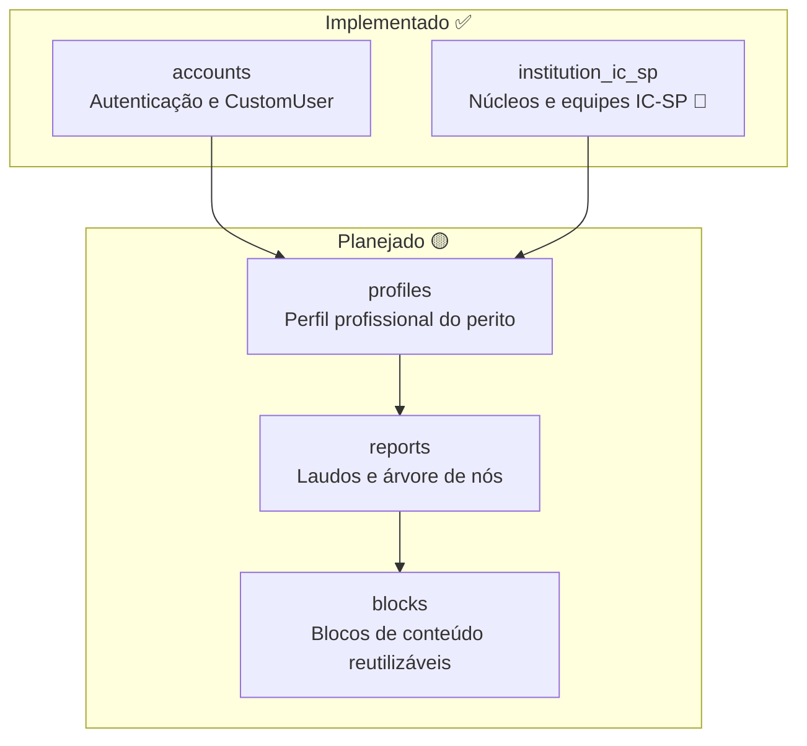
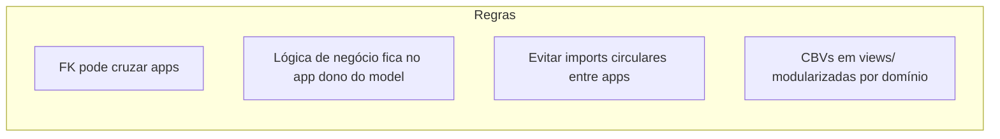

# Mapa de Apps Django

Organização modular prevista para o ReportLine. Cada app representa um
**bounded context** com responsabilidade única.

## Visão geral



## Detalhamento por app

### `accounts` ✅

| Item | Valor |
|---|---|
| **Responsabilidade** | Autenticação, sessão, `CustomUser` |
| **Models** | `CustomUser` |
| **Views** | `LoginView` (placeholder CBV) |
| **Depende de** | `django.contrib.auth` |
| **Consumido por** | `profiles` (futuro) |
| **Alvo institucional** | Login **gov.br** (OIDC) — ver [ADR-0003](../decisions/0003-govbr-authentication.md) |

```
accounts/
  models/
    custom_user.py
  views/
    auth_views.py
  admin/
    user_admin.py
  tests/
    test_custom_user.py
    test_auth_views.py
  urls.py
```

---

### `institution_ic_sp` ✅ 🔵

| Item | Valor |
|---|---|
| **Responsabilidade** | Cadastro provisório de núcleos e equipes periciais do IC-SP |
| **Models** | `Institution`, `ForensicNucleus`, `ForensicTeam` |
| **Depende de** | `common` (`BaseModel`) |
| **Consumido por** | `profiles` (futuro — lotação do perito) |
| **Substituição** | Integração institucional equivalente — ver [ADR-0006](../decisions/0006-provisional-institution-ic-sp.md) |

```
institution_ic_sp/
  models/
    institution.py
    forensic_nucleus.py
    forensic_team.py
  data/
    ic_sp_seed.py
  admin/
    institution_admin.py
    forensic_nucleus_admin.py
    forensic_team_admin.py
  management/commands/
    load_ic_sp_data.py
  tests/
    test_institution_models.py
  templates/institution_ic_sp/
  static/institution_ic_sp/
  urls.py
```

Documentação completa: [04-institution-ic-sp.md](./04-institution-ic-sp.md).

---

### `profiles` 🟡

| Item | Valor |
|---|---|
| **Responsabilidade** | Dados profissionais do perito (registro, cargo, etc.) |
| **Models** | `Profile` (1:1 com `CustomUser`) |
| **Depende de** | `accounts`, `institution_ic_sp` (futuro — lotação) |
| **Consumido por** | `reports` |

---

### `reports` 🟡

| Item | Valor |
|---|---|
| **Responsabilidade** | Laudos (`Report`) e composição hierárquica (`NodeReport`) |
| **Models** | `Report`, `NodeReport` |
| **Depende de** | `profiles`, `blocks` |
| **Consumido por** | — (app de domínio principal) |
| **Integrações futuras** | APIs externas (IA, voz) via variáveis de ambiente — ver [ADR-0005](../decisions/0005-external-api-credentials.md) |

---

### `blocks` 🟡

| Item | Valor |
|---|---|
| **Responsabilidade** | Tipos de conteúdo reutilizáveis (texto, tabela, imagem…) |
| **Models** | `Block` |
| **Depende de** | — (app base, sem FK externa) |
| **Consumido por** | `reports` |

---

## Regras de dependência entre apps



1. **Dependência unidirecional:** `accounts` → `profiles` → `reports` → consome `blocks`; `institution_ic_sp` alimenta `profiles`.
2. **`blocks` é independente:** não conhece `reports`; quem referencia é `NodeReport`.
3. **Testes espelham a estrutura:** `app/tests/test_<dominio>.py`.
4. **URLs por app:** cada app expõe seu `urls.py` incluído no `reportline/urls.py`.

## Registro no Django

| App | `INSTALLED_APPS` | Status |
|---|---|---|
| `accounts` | ✅ registrado | implementado |
| `institution_ic_sp` | ✅ registrado | implementado (provisório) |
| `profiles` | 🟡 pendente | — |
| `reports` | 🟡 pendente | — |
| `blocks` | 🟡 pendente | — |

## Infraestrutura e integrações transversais

Decisões que atravessam apps (não pertencem a um único bounded context):

| Tema | Desenvolvimento | Institucional | ADR |
|---|---|---|---|
| **SGBD** | PostgreSQL | Outro SGBD a critério do órgão | [0004](../decisions/0004-postgresql-sgbd.md) |
| **Autenticação** | Django local (placeholder) | Login gov.br (OIDC) | [0003](../decisions/0003-govbr-authentication.md) |
| **APIs externas** | Credenciais pessoais (`.env`) | Credenciais institucionais | [0005](../decisions/0005-external-api-credentials.md) |
| **Cadastro IC-SP** | App local `institution_ic_sp` | Cadastro oficial SPTC | [0006](../decisions/0006-provisional-institution-ic-sp.md) |

Visão consolidada em [01-context.md](./01-context.md).

## Referências

- [Modelo de dados (ERD)](./02-data-model.md)
- [ADR-0002: Estrutura de laudo modular](../decisions/0002-report-node-structure.md)
- [ADR-0003: Autenticação gov.br (institucional)](../decisions/0003-govbr-authentication.md)
- [ADR-0004: PostgreSQL como SGBD padrão](../decisions/0004-postgresql-sgbd.md)
- [ADR-0005: Credenciais de APIs externas](../decisions/0005-external-api-credentials.md)
- [App institution_ic_sp](./04-institution-ic-sp.md)
- [ADR-0006: App provisório IC-SP](../decisions/0006-provisional-institution-ic-sp.md)
