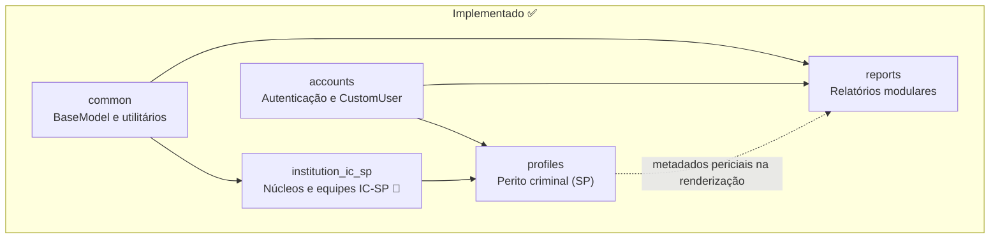
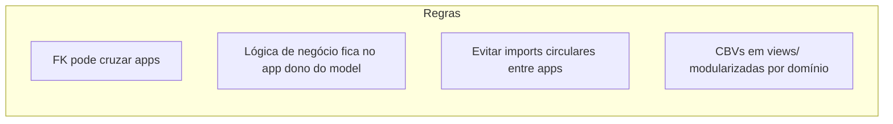

# Mapa de Apps Django

Organização modular prevista para o ReportLine. Cada app representa um
**bounded context** com responsabilidade única.

## Visão geral



## Detalhamento por app

### `common` ✅

| Item | Valor |
|---|---|
| **Responsabilidade** | Bases e utilitários compartilhados entre apps |
| **Models** | `BaseModel` (UUID, `created_at`, `updated_at`) |
| **Utilitários** | `user_messages.notify_*` (flash messages padronizados) |
| **Depende de** | — |
| **Consumido por** | `institution_ic_sp`, `profiles`, `reports`, layout global (`base.html`) |
| **Documentação** | [06-user-messaging.md](./06-user-messaging.md) (mensagens) |

```
common/
  models/
    base_model.py
  user_messages.py
  tests/
    test_base_model.py
    test_user_messages.py
```

---

### `accounts` ✅

| Item | Valor |
|---|---|
| **Responsabilidade** | Autenticação, sessão, `CustomUser`, OAuth Google (dev/pessoal) |
| **Models** | `CustomUser` (`auth_provider`, `external_subject`) |
| **Views** | `LoginView`, `LogoutView` (CBV Django auth) |
| **Serviços** | `oauth_user_service.provision_oauth_user()` |
| **Integrações** | `django-allauth` (Google); alvo fase 2: gov.br OIDC |
| **Depende de** | `django.contrib.auth`, `django-allauth` |
| **Consumido por** | `profiles`, `reports` (autor do relatório) |
| **Decisão** | [ADR-0003](../decisions/0003-govbr-authentication.md) |

```
accounts/
  models/
    custom_user.py
  views/
    auth_views.py
  services/
    oauth_user_service.py
  adapters/
    custom_social_account_adapter.py
  admin/
    user_admin.py
  templates/
    accounts/login.html
    accounts/includes/
    socialaccount/              # overrides allauth
  tests/
    test_custom_user.py
    test_auth_views.py
    test_oauth_user_service.py
    test_social_account_adapter.py
  urls.py                       # login, logout
```

Rotas OAuth (em `reportline/urls.py`): `/accounts/social/` → django-allauth.

---

### `institution_ic_sp` ✅ 🔵

| Item | Valor |
|---|---|
| **Responsabilidade** | Cadastro provisório de núcleos e equipes periciais do IC-SP |
| **Models** | `Institution`, `ForensicNucleus`, `ForensicTeam` |
| **Depende de** | `common` (`BaseModel`) |
| **Consumido por** | `profiles` (lotação do perito) |
| **Substituição** | Integração institucional equivalente — ver [ADR-0006](../decisions/0006-provisional-institution-ic-sp.md) |

```
institution_ic_sp/
  models/
    institution.py
    forensic_nucleus.py
    forensic_team.py
  data/
    ic_sp_seed.py
  admin/
    institution_admin.py
    forensic_nucleus_admin.py
    forensic_team_admin.py
  management/commands/
    load_ic_sp_data.py
  tests/
    test_institution_models.py
  templates/institution_ic_sp/
  static/institution_ic_sp/
  urls.py
```

Documentação completa: [04-institution-ic-sp.md](./04-institution-ic-sp.md).

---

### `profiles` ✅

| Item | Valor |
|---|---|
| **Responsabilidade** | Perfil profissional do perito criminal de SP |
| **Models** | `ForensicExaminerSP` (1:1 com `CustomUser`, N:1 com `ForensicTeam`) |
| **Depende de** | `accounts`, `institution_ic_sp`, `common` |
| **Relação com `reports`** | Metadados periciais (lotação, `display_name`) enriquecem laudos na renderização; autor do relatório é `CustomUser` |
| **Decisão** | [ADR-0007](../decisions/0007-forensic-examiner-sp.md) |

```
profiles/
  models/
    forensic_examiner_sp.py
  admin/
    forensic_examiner_sp_admin.py
  forms/
  services/
  tests/
    test_forensic_examiner_sp.py
  templates/profiles/
  static/profiles/
  urls.py
  views/
```

Documentação completa: [05-profiles.md](./05-profiles.md).

---

### `reports` ✅

| Item | Valor |
|---|---|
| **Responsabilidade** | Relatórios modulares (`Report`), árvore de nós (`ReportNode`) e blocos genéricos (`ReportBlock`) |
| **Models** | `Report`, `ReportNode`, `ReportBlock` |
| **URLs (usuário)** | `reports:list`, `reports:new`, `reports:edit`, `reports:outline`, `reports:image_upload`, `reports:node_create`, `reports:node_update`, `reports:node_reorder` |
| **Hub na home** | Cards em `templates/index.html` (autenticado) |
| **Depende de** | `accounts`, `common` |
| **Integrações futuras** | APIs externas (IA, voz) via variáveis de ambiente — ver [ADR-0005](../decisions/0005-external-api-credentials.md) |
| **Decisão** | [ADR-0002](../decisions/0002-report-node-structure.md) |

```
reports/
  models/
    report.py
    report_node.py
    report_block.py
    report_image.py
  admin/
    report_admin.py
    report_block_admin.py
    report_node_admin.py
  forms/
    report_form.py
  views/
    report_list_views.py
    report_create_views.py
    report_editor_views.py
    report_image_api_views.py
    report_node_api_views.py
  services/
    author_snapshot.py
    report_creation.py
    report_editor_bootstrap.py
    report_editor_context.py
    report_block_content.py
    report_block_image_cleanup.py
    report_block_sequence.py
    report_heading_numbering.py
    report_image_processing.py
    report_image_upload.py
    report_table_cell_content.py
    report_table_column_widths.py
    report_table_structure.py
    report_tree.py
  static/reports/
    css/report_editor.css
    js/                         # editor, tabelas, imagens, sumário
  templates/reports/
    report_list.html
    report_form.html
    report_editor.html
    includes/
  tests/                        # ver 07-reports.md — Testes
  migrations/
  urls.py                       # /reports/, API JSON do editor
```

Documentação completa (editor, payloads, API): [07-reports.md](./07-reports.md).

---

## Regras de dependência entre apps



1. **Dependência unidirecional:** `accounts` → `profiles`; `accounts` → `reports`; `institution_ic_sp` alimenta `profiles`.
2. **`ReportBlock` vive em `reports`:** blocos genéricos não formam app separado na fase atual.
3. **Testes espelham a estrutura:** `app/tests/test_<dominio>.py`.
4. **URLs por app:** cada app expõe seu `urls.py` incluído no `reportline/urls.py`.

## Registro no Django

| App | `INSTALLED_APPS` | Status |
|---|---|---|
| `common` | ✅ registrado | implementado |
| `accounts` | ✅ registrado | implementado |
| `institution_ic_sp` | ✅ registrado | implementado (provisório) |
| `profiles` | ✅ registrado | implementado |
| `reports` | ✅ registrado | implementado (listagem, criação, editor interativo, API de nós) |

## Infraestrutura e integrações transversais

Decisões que atravessam apps (não pertencem a um único bounded context):

| Tema | Desenvolvimento | Institucional | Referência |
|---|---|---|---|
| **SGBD** | PostgreSQL | Outro SGBD a critério do órgão | [0004](../decisions/0004-postgresql-sgbd.md) |
| **Autenticação** | Google OAuth + local staff (dev/pessoal); gov.br (institucional) | [0003](../decisions/0003-govbr-authentication.md) |
| **APIs externas** | Credenciais pessoais (`.env` + `var/secrets/`) | Credenciais institucionais | [0005](../decisions/0005-external-api-credentials.md) |
| **Cadastro IC-SP** | App local `institution_ic_sp` | Cadastro oficial SPTC | [0006](../decisions/0006-provisional-institution-ic-sp.md) |
| **Mensagens ao usuário** | Toasts + modal Bootstrap via `common.user_messages` | — | [06-user-messaging.md](./06-user-messaging.md) |

Visão consolidada em [01-context.md](./01-context.md).

## Referências

- [Modelo de dados (ERD)](./02-data-model.md)
- [App reports](./07-reports.md)
- [ADR-0002: Estrutura de laudo modular](../decisions/0002-report-node-structure.md)
- [ADR-0003: Autenticação gov.br (institucional)](../decisions/0003-govbr-authentication.md)
- [ADR-0004: PostgreSQL como SGBD padrão](../decisions/0004-postgresql-sgbd.md)
- [ADR-0005: Credenciais de APIs externas](../decisions/0005-external-api-credentials.md)
- [App institution_ic_sp](./04-institution-ic-sp.md)
- [App profiles](./05-profiles.md)
- [Mensagens ao usuário](./06-user-messaging.md)
- [ADR-0006: App provisório IC-SP](../decisions/0006-provisional-institution-ic-sp.md)
- [ADR-0007: ForensicExaminerSP](../decisions/0007-forensic-examiner-sp.md)
