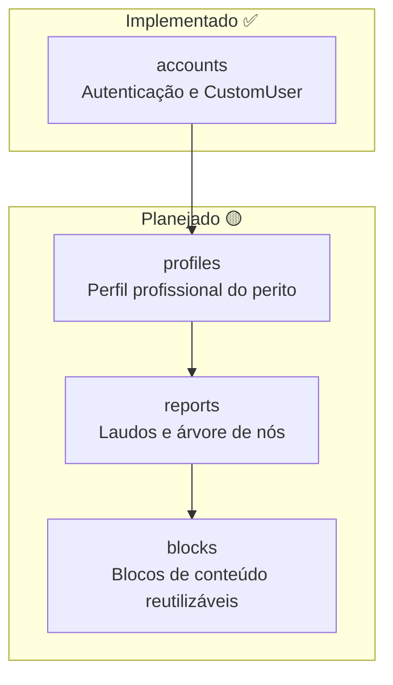
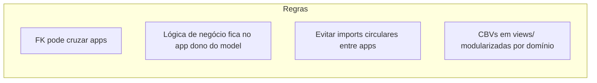

# Mapa de Apps Django

Organização modular prevista para o ReportLine. Cada app representa um
**bounded context** com responsabilidade única.

## Visão geral



## Detalhamento por app

### `accounts` ✅

| Item | Valor |
|---|---|
| **Responsabilidade** | Autenticação, sessão, `CustomUser` |
| **Models** | `CustomUser` |
| **Views** | `LoginView` (placeholder CBV) |
| **Depende de** | `django.contrib.auth` |
| **Consumido por** | `profiles` (futuro) |

```
accounts/
  models/
    custom_user.py
  views/
    auth_views.py
  admin/
    user_admin.py
  tests/
    test_custom_user.py
    test_auth_views.py
  urls.py
```

---

### `profiles` 🟡

| Item | Valor |
|---|---|
| **Responsabilidade** | Dados profissionais do perito (registro, cargo, etc.) |
| **Models** | `Profile` (1:1 com `CustomUser`) |
| **Depende de** | `accounts` |
| **Consumido por** | `reports` |

---

### `reports` 🟡

| Item | Valor |
|---|---|
| **Responsabilidade** | Laudos (`Report`) e composição hierárquica (`NodeReport`) |
| **Models** | `Report`, `NodeReport` |
| **Depende de** | `profiles`, `blocks` |
| **Consumido por** | — (app de domínio principal) |

---

### `blocks` 🟡

| Item | Valor |
|---|---|
| **Responsabilidade** | Tipos de conteúdo reutilizáveis (texto, tabela, imagem…) |
| **Models** | `Block` |
| **Depende de** | — (app base, sem FK externa) |
| **Consumido por** | `reports` |

---

## Regras de dependência entre apps



1. **Dependência unidirecional:** `accounts` → `profiles` → `reports` → consome `blocks`.
2. **`blocks` é independente:** não conhece `reports`; quem referencia é `NodeReport`.
3. **Testes espelham a estrutura:** `app/tests/test_<dominio>.py`.
4. **URLs por app:** cada app expõe seu `urls.py` incluído no `reportline/urls.py`.

## Registro no Django

| App | `INSTALLED_APPS` | Status |
|---|---|---|
| `accounts` | ✅ registrado | implementado |
| `profiles` | 🟡 pendente | — |
| `reports` | 🟡 pendente | — |
| `blocks` | 🟡 pendente | — |

## Referências

- [Modelo de dados (ERD)](./02-data-model.md)
- [ADR-0002: Estrutura de laudo modular](../decisions/0002-report-node-structure.md)
