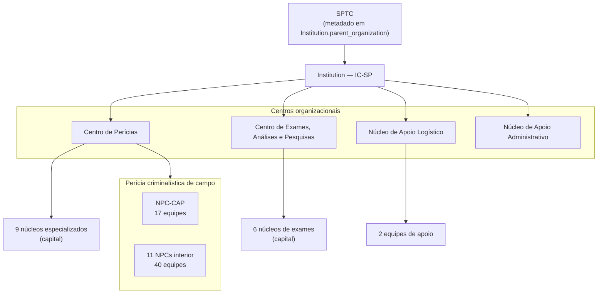

# reportline/docs/architecture/04-institution-ic-sp.md
# App `institution_ic_sp` — Dados institucionais provisórios

Cadastro local da estrutura organizacional do **Instituto de Criminalística de
São Paulo (IC-SP)**, mantido durante o desenvolvimento do ReportLine e
substituível pelo equivalente institucional em produção.

> **Decisão:** [ADR-0006](../decisions/0006-provisional-institution-ic-sp.md)

---

## Propósito

| Aspecto | Descrição |
|---|---|
| **Problema** | Desenvolvimento local sem acesso ao cadastro oficial da SPTC |
| **Solução** | Espelhar núcleos e equipes periciais em tabelas Django pré-populadas |
| **Substituição** | Integração institucional futura ou desativação do app |
| **Flag** | `Institution.is_provisional = True` |

---

## Estrutura do app

```
institution_ic_sp/
├── admin/                    # Registradores por model
├── data/
│   └── ic_sp_seed.py         # Fonte de verdade dos dados iniciais
├── management/commands/
│   └── load_ic_sp_data.py    # Repovoamento manual
├── migrations/
│   ├── 0001_initial.py
│   ├── 0002_load_ic_sp_seed_data.py
│   └── 0003_institution_sp_logo_institution_sptc_logo.py
├── models/
│   ├── institution.py
│   ├── forensic_nucleus.py
│   └── forensic_team.py
├── static/institution_ic_sp/ # Namespace para assets futuros
├── templates/institution_ic_sp/ # Namespace para templates futuros
├── tests/
│   └── test_institution_models.py
├── urls.py                   # app_name = "institution_ic_sp"
└── views/
```

---

## Models

### `Institution`

Representa o IC-SP como órgão pericial de referência.

| Campo | Tipo | Descrição |
|---|---|---|
| `name` | CharField | Nome completo oficial |
| `acronym` | CharField (UK) | Sigla (`IC-SP`) |
| `parent_organization` | CharField | Órgão superior (SPTC) |
| `legal_reference` | CharField | Ato normativo (Decreto 42.847/1998) |
| `headquarters_city` | CharField | Município-sede |
| `is_provisional` | BooleanField | Indica cadastro substituível |
| `sp_logo` | ImageField | Logo do Governo de SP (cabeçalho do laudo) |
| `sptc_logo` | ImageField | Logo da SPTC (cabeçalho do laudo) |

Herdado de `BaseModel`: `id` (UUID), `created_at`, `updated_at`.

Os campos de logo são **opcionais** (`blank=True`). O banco guarda apenas o
**caminho relativo** do arquivo; os bytes ficam em `MEDIA_ROOT` (ver seção
[Logos e mídia no deploy](#logos-e-mídia-no-deploy)).

### `ForensicNucleus`

Unidade pericial (núcleo) subordinada à instituição.

| Campo | Tipo | Descrição |
|---|---|---|
| `institution` | FK → Institution | Instituição proprietária |
| `code` | CharField (UK) | Código institucional (ex.: `NPC-CAP`, `IC-NAT`) |
| `name` | CharField | Denominação completa |
| `nucleus_type` | TextChoices | Ver tabela abaixo |
| `organizational_center` | TextChoices | Centro organizacional |
| `headquarters_city` | CharField | Município-sede |
| `sort_order` | PositiveSmallIntegerField | Ordem de exibição |

**Tipos de núcleo (`nucleus_type`):**

| Valor | Significado |
|---|---|
| `specialized` | Núcleo especializado (capital) |
| `field_capital` | Perícia criminalística — capital e Grande SP |
| `field_interior` | Perícia criminalística — interior |
| `support` | Apoio (logístico ou administrativo) |

**Centros organizacionais (`organizational_center`):**

| Valor | Significado |
|---|---|
| `forensic_expertise` | Centro de Perícias |
| `exams_research` | Centro de Exames, Análises e Pesquisas |
| `logistic_support` | Núcleo de Apoio Logístico |
| `admin_support` | Núcleo de Apoio Administrativo |

### `ForensicTeam`

Equipe de perícias criminalísticas ou equipe técnica de apoio.

| Campo | Tipo | Descrição |
|---|---|---|
| `nucleus` | FK → ForensicNucleus | Núcleo supervisor |
| `code` | CharField (UK) | Código institucional (ex.: `EPC-SPC`) |
| `name` | CharField | Denominação completa |
| `headquarters_city` | CharField | Município-sede |
| `is_embedded_unit` | BooleanField | Atua junto a órgão parceiro (DHPP, DEIC, DETRAN) |
| `sort_order` | PositiveSmallIntegerField | Ordem de exibição |

---

## Hierarquia organizacional



---

## Dados carregados (seed)

| Entidade | Quantidade | Observação |
|---|---|---|
| `Institution` | 1 | IC-SP |
| `ForensicNucleus` | 29 | 17 especializados/apoio + 1 capital + 11 interior |
| `ForensicTeam` | 59 | 17 + 40 + 2 (apoio logístico) |

### Equipes da capital e Grande SP (`NPC-CAP`) — 17

| Código | Nome resumido | Município |
|---|---|---|
| `EPC-SPC` | Centro | São Paulo |
| `EPC-SPN` | Norte | São Paulo |
| `EPC-SPS` | Sul | São Paulo |
| `EPC-SPL1` | Leste | São Paulo |
| `EPC-SPL2` | São Mateus | São Paulo |
| `EPC-SPO` | Oeste | São Paulo |
| `EPC-HPP` | DHPP ⚓ | São Paulo |
| `EPC-DEIC` | DEIC ⚓ | São Paulo |
| `EPC-DETRAN` | DETRAN ⚓ | São Paulo |
| `EPC-GRU` | Guarulhos | Guarulhos |
| `EPC-MCR` | Mogi das Cruzes | Mogi das Cruzes |
| `EPC-BRU` | Barueri | Barueri |
| `EPC-SAD` | Santo André | Santo André |
| `EPC-SBC` | São Bernardo do Campo | São Bernardo do Campo |
| `EPC-TSE` | Taboão da Serra | Taboão da Serra |
| `EPC-FRO` | Franco da Rocha | Franco da Rocha |
| `EPC-SPS2` | Sul 2 | São Paulo |

⚓ = equipe embutida (`is_embedded_unit = True`)

### Núcleos do interior — 11 NPCs, 40 equipes

| Código | Sede | Equipes |
|---|---|---|
| `NPC-AME` | Americana | 5 |
| `NPC-ARB` | Araçatuba | 2 |
| `NPC-ARQ` | Araraquara | 2 |
| `NPC-BAU` | Bauru | 4 |
| `NPC-CPS` | Campinas | 3 |
| `NPC-PPR` | Presidente Prudente | 4 |
| `NPC-RPR` | Ribeirão Preto | 4 |
| `NPC-SAN` | Santos | 3 |
| `NPC-SJC` | São José dos Campos | 5 |
| `NPC-SRP` | São José do Rio Preto | 4 |
| `NPC-SOR` | Sorocaba | 4 |

Lista completa de equipes em `institution_ic_sp/data/ic_sp_seed.py`.

---

## Carga e manutenção de dados

### Automática (migrate)

```bash
python manage.py migrate
```

A migration `0002_load_ic_sp_seed_data` executa `load_ic_sp_institution_data()`.

### Manual (repovoamento)

```bash
# Idempotente — cria apenas registros ausentes
python manage.py load_ic_sp_data

# Remove tudo e recria
python manage.py load_ic_sp_data --clear
```

### Atualizar após mudança no organograma

1. Editar `institution_ic_sp/data/ic_sp_seed.py`.
2. Rodar `load_ic_sp_data --clear` em dev ou criar nova data migration.
3. Atualizar testes em `tests/test_institution_models.py` se contagens mudarem.
4. Sincronizar esta documentação.

---

## Logos e mídia no deploy

Os logos institucionais (`sp_logo`, `sptc_logo`) usam `ImageField` do Django.
O projeto persiste uploads em **`MEDIA_ROOT`** (padrão: `media/` na raiz do
repositório), servidos em desenvolvimento via `MEDIA_URL` (`/media/`).

### O que sobe no Git vs. o que fica no servidor

| Item | Versionado no Git? | Onde vive |
|---|---|---|
| Código, migrations, seed de núcleos/equipes | ✅ Sim | Repositório |
| Pasta `media/` (uploads) | ❌ Não | Disco do servidor (`.gitignore`) |
| Registro `Institution` no banco | ✅ Sim (via migrate + seed) | PostgreSQL |
| Caminho dos logos no banco | ✅ Sim (colunas `sp_logo`, `sptc_logo`) | PostgreSQL |
| Arquivo PNG dos logos | ❌ Não | `media/institution_ic_sp/logos/` no servidor |

**Importante:** fazer `git pull` ou deploy do código **não copia** as imagens.
Após publicar uma versão nova, o operador do servidor precisa garantir que os
arquivos de mídia existam e permaneçam acessíveis — ou refazer o upload pelo
admin.

### Desenvolvimento local

1. Criar a estrutura (opcional; o Django cria no primeiro upload):

   ```bash
   mkdir -p media/institution_ic_sp/logos
   ```

2. Aplicar migrations e carregar dados institucionais:

   ```bash
   python manage.py migrate
   ```

3. Enviar os logos pelo **Django Admin** → Instituição → seção *Logos do
   cabeçalho* (PNG recomendado, imagens pequenas).

4. Em `DEBUG=True`, o próprio Django serve `/media/`; não é necessário nginx
   local.

Dependência: **Pillow** (`requirements.txt`) — exigida pelo `ImageField`.

### Hospedagem / produção

Checklist para quem opera o servidor:

1. **Diretório persistente:** garantir que `MEDIA_ROOT` aponte para volume
   persistente (ex.: `/var/www/reportline/media/`), com permissão de escrita
   para o usuário do processo WSGI/ASGI.

2. **Servir arquivos estáticos de mídia:** o Django **não** deve servir
   `/media/` em produção. Configurar o reverse proxy (nginx, Apache, CDN) para
   mapear `MEDIA_URL` → `MEDIA_ROOT`, ou usar storage externo (S3, etc.).

3. **Backup:** incluir `MEDIA_ROOT` nos backups operacionais, junto com o
   banco. Restaurar só o PostgreSQL **não** traz os PNGs de volta.

4. **Primeiro deploy ou servidor novo:**
   - rodar `migrate` (cria colunas e seed da instituição);
   - fazer upload dos logos no admin **ou** copiar manualmente os arquivos para
     `media/institution_ic_sp/logos/` e atualizar os caminhos no banco (preferir
     admin para evitar inconsistência).

5. **Deploys seguintes:** preservar o volume de `media/` entre releases; não
   sobrescrever nem apagar a pasta no pipeline de deploy.

6. **Ambientes múltiplos:** cada ambiente (dev, homolog, prod) mantém sua
   própria cópia de `media/`; não há sincronização automática pelo Git.

### Caminho de upload

`upload_to="institution_ic_sp/logos/"` — arquivos gravados em:

```
media/
└── institution_ic_sp/
    └── logos/
        ├── sp_logo.png      # exemplo
        └── sptc_logo.png    # exemplo
```

Os nomes finais podem variar (sufixo aleatório do Django se houver colisão).

---

## Integração Django

| Item | Valor |
|---|---|
| `INSTALLED_APPS` | `institution_ic_sp` |
| URLs | `/institution-ic-sp/` — namespace `institution_ic_sp` (sem views ainda) |
| Admin | `Institution`, `ForensicNucleus`, `ForensicTeam` registrados |
| Templates | `templates/institution_ic_sp/` (`APP_DIRS=True`) |
| Static | `static/institution_ic_sp/` — `` |

---

## Uso por outros apps


Implementado:

- `ForensicExaminerSP.forensic_team` — lotação do perito ([05-profiles.md](./05-profiles.md))

Previsto:

- Filtro de laudos por núcleo ou equipe
- Relatórios administrativos por unidade

---

## Substituição institucional

Quando o cadastro oficial estiver disponível:

1. **Opção A:** trocar a implementação de `load_ic_sp_institution_data()` por
   importação de API/arquivo institucional, mantendo os mesmos models.
2. **Opção B:** criar app substituto com interface equivalente e migrar FKs.
3. **Opção C:** desativar `institution_ic_sp` em `INSTALLED_APPS` após migração
   de dados para app/serviço definitivo.

Em qualquer cenário, preservar **UUIDs estáveis** ou planejar migration de FKs
nos apps consumidores.

---

## Fontes normativas

| Fonte | Uso |
|---|---|
| Decreto nº 42.847/1998 | Estrutura legal do IC-SP |
| Decreto nº 48.009/2003 | Atribuições dos NPCs e EPCs |
| Res. SSP-12/2020 | Municípios-sede de NPC/NPML |
| Portaria SPTC-85/2020 | Áreas de atendimento das equipes |
| Organograma SPTC rev. 15 | Códigos NPC/EPC |
| [policiacientifica.sp.gov.br](https://www.policiacientifica.sp.gov.br/) | Telefones e unidades |

---

---

## Módulo `forensic_report` (laudo pericial)

Pacote dentro de `institution_ic_sp` — intake, bootstrap assistido por IA,
dossiê confirmado e workflows por tipo de exame.

| Aspecto | Descrição |
|---|---|
| **Intake** | Upload de documentos, campos manuais, análise com IA (`case_intake`) |
| **Bootstrap** | Montagem inicial do laudo a partir de metadados confirmados |
| **Dossiê** | `ForensicReportMetadata.data` — fases `initial_data`, `property_crime`, … |
| **IA externa** | Gateway único; texto sanitizado localmente antes da OpenAI |
| **Workflows** | `initial_data` (metadados administrativos), `property_crime` (exame de local) |

Documentação operacional: [09-forensic-ai-privacy.md](./09-forensic-ai-privacy.md).

---

## Referências

- [ADR-0006: App provisório IC-SP](../decisions/0006-provisional-institution-ic-sp.md)
- [ADR-0008: Sanitização PII antes de IA externa](../decisions/0008-ai-pii-sanitization.md)
- [09-forensic-ai-privacy.md](./09-forensic-ai-privacy.md)
- [ADR-0007: ForensicExaminerSP](../decisions/0007-forensic-examiner-sp.md)
- [App profiles](./05-profiles.md)
- [Modelo de dados — seção IC-SP](./02-data-model.md#dados-institucionais-ic-sp-)
- [Mapa de apps](./03-apps-map.md)
