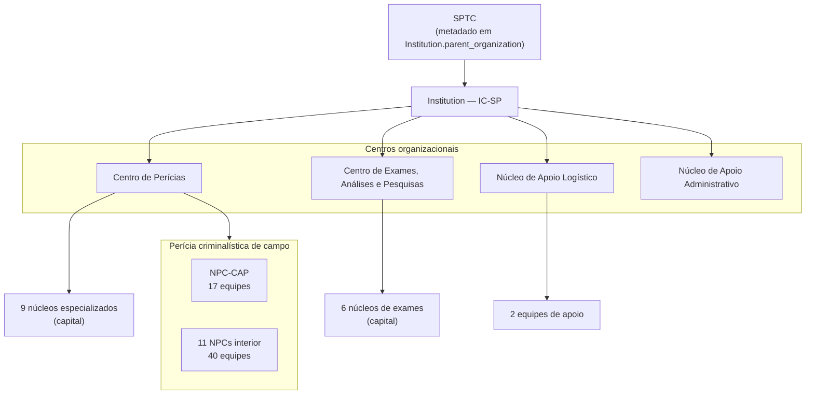

# App `institution_ic_sp` — Dados institucionais provisórios

Cadastro local da estrutura organizacional do **Instituto de Criminalística de
São Paulo (IC-SP)**, mantido durante o desenvolvimento do ReportLine e
substituível pelo equivalente institucional em produção.

> **Decisão:** [ADR-0006](../decisions/0006-provisional-institution-ic-sp.md)

---

## Propósito

| Aspecto | Descrição |
|---|---|
| **Problema** | Desenvolvimento local sem acesso ao cadastro oficial da SPTC |
| **Solução** | Espelhar núcleos e equipes periciais em tabelas Django pré-populadas |
| **Substituição** | Integração institucional futura ou desativação do app |
| **Flag** | `Institution.is_provisional = True` |

---

## Estrutura do app

```
institution_ic_sp/
├── admin/                    # Registradores por model
├── data/
│   └── ic_sp_seed.py         # Fonte de verdade dos dados iniciais
├── management/commands/
│   └── load_ic_sp_data.py    # Repovoamento manual
├── migrations/
│   ├── 0001_initial.py
│   └── 0002_load_ic_sp_seed_data.py
├── models/
│   ├── institution.py
│   ├── forensic_nucleus.py
│   └── forensic_team.py
├── static/institution_ic_sp/ # Namespace para assets futuros
├── templates/institution_ic_sp/ # Namespace para templates futuros
├── tests/
│   └── test_institution_models.py
├── urls.py                   # app_name = "institution_ic_sp"
└── views/
```

---

## Models

### `Institution`

Representa o IC-SP como órgão pericial de referência.

| Campo | Tipo | Descrição |
|---|---|---|
| `name` | CharField | Nome completo oficial |
| `acronym` | CharField (UK) | Sigla (`IC-SP`) |
| `parent_organization` | CharField | Órgão superior (SPTC) |
| `legal_reference` | CharField | Ato normativo (Decreto 42.847/1998) |
| `headquarters_city` | CharField | Município-sede |
| `is_provisional` | BooleanField | Indica cadastro substituível |

Herdado de `BaseModel`: `id` (UUID), `created_at`, `updated_at`.

### `ForensicNucleus`

Unidade pericial (núcleo) subordinada à instituição.

| Campo | Tipo | Descrição |
|---|---|---|
| `institution` | FK → Institution | Instituição proprietária |
| `code` | CharField (UK) | Código institucional (ex.: `NPC-CAP`, `IC-NAT`) |
| `name` | CharField | Denominação completa |
| `nucleus_type` | TextChoices | Ver tabela abaixo |
| `organizational_center` | TextChoices | Centro organizacional |
| `headquarters_city` | CharField | Município-sede |
| `sort_order` | PositiveSmallIntegerField | Ordem de exibição |

**Tipos de núcleo (`nucleus_type`):**

| Valor | Significado |
|---|---|
| `specialized` | Núcleo especializado (capital) |
| `field_capital` | Perícia criminalística — capital e Grande SP |
| `field_interior` | Perícia criminalística — interior |
| `support` | Apoio (logístico ou administrativo) |

**Centros organizacionais (`organizational_center`):**

| Valor | Significado |
|---|---|
| `forensic_expertise` | Centro de Perícias |
| `exams_research` | Centro de Exames, Análises e Pesquisas |
| `logistic_support` | Núcleo de Apoio Logístico |
| `admin_support` | Núcleo de Apoio Administrativo |

### `ForensicTeam`

Equipe de perícias criminalísticas ou equipe técnica de apoio.

| Campo | Tipo | Descrição |
|---|---|---|
| `nucleus` | FK → ForensicNucleus | Núcleo supervisor |
| `code` | CharField (UK) | Código institucional (ex.: `EPC-SPC`) |
| `name` | CharField | Denominação completa |
| `headquarters_city` | CharField | Município-sede |
| `is_embedded_unit` | BooleanField | Atua junto a órgão parceiro (DHPP, DEIC, DETRAN) |
| `sort_order` | PositiveSmallIntegerField | Ordem de exibição |

---

## Hierarquia organizacional



---

## Dados carregados (seed)

| Entidade | Quantidade | Observação |
|---|---|---|
| `Institution` | 1 | IC-SP |
| `ForensicNucleus` | 29 | 17 especializados/apoio + 1 capital + 11 interior |
| `ForensicTeam` | 59 | 17 + 40 + 2 (apoio logístico) |

### Equipes da capital e Grande SP (`NPC-CAP`) — 17

| Código | Nome resumido | Município |
|---|---|---|
| `EPC-SPC` | Centro | São Paulo |
| `EPC-SPN` | Norte | São Paulo |
| `EPC-SPS` | Sul | São Paulo |
| `EPC-SPL1` | Leste | São Paulo |
| `EPC-SPL2` | São Mateus | São Paulo |
| `EPC-SPO` | Oeste | São Paulo |
| `EPC-HPP` | DHPP ⚓ | São Paulo |
| `EPC-DEIC` | DEIC ⚓ | São Paulo |
| `EPC-DETRAN` | DETRAN ⚓ | São Paulo |
| `EPC-GRU` | Guarulhos | Guarulhos |
| `EPC-MCR` | Mogi das Cruzes | Mogi das Cruzes |
| `EPC-BRU` | Barueri | Barueri |
| `EPC-SAD` | Santo André | Santo André |
| `EPC-SBC` | São Bernardo do Campo | São Bernardo do Campo |
| `EPC-TSE` | Taboão da Serra | Taboão da Serra |
| `EPC-FRO` | Franco da Rocha | Franco da Rocha |
| `EPC-SPS2` | Sul 2 | São Paulo |

⚓ = equipe embutida (`is_embedded_unit = True`)

### Núcleos do interior — 11 NPCs, 40 equipes

| Código | Sede | Equipes |
|---|---|---|
| `NPC-AME` | Americana | 5 |
| `NPC-ARB` | Araçatuba | 2 |
| `NPC-ARQ` | Araraquara | 2 |
| `NPC-BAU` | Bauru | 4 |
| `NPC-CPS` | Campinas | 3 |
| `NPC-PPR` | Presidente Prudente | 4 |
| `NPC-RPR` | Ribeirão Preto | 4 |
| `NPC-SAN` | Santos | 3 |
| `NPC-SJC` | São José dos Campos | 5 |
| `NPC-SRP` | São José do Rio Preto | 4 |
| `NPC-SOR` | Sorocaba | 4 |

Lista completa de equipes em `institution_ic_sp/data/ic_sp_seed.py`.

---

## Carga e manutenção de dados

### Automática (migrate)

```bash
python manage.py migrate
```

A migration `0002_load_ic_sp_seed_data` executa `load_ic_sp_institution_data()`.

### Manual (repovoamento)

```bash
# Idempotente — cria apenas registros ausentes
python manage.py load_ic_sp_data

# Remove tudo e recria
python manage.py load_ic_sp_data --clear
```

### Atualizar após mudança no organograma

1. Editar `institution_ic_sp/data/ic_sp_seed.py`.
2. Rodar `load_ic_sp_data --clear` em dev ou criar nova data migration.
3. Atualizar testes em `tests/test_institution_models.py` se contagens mudarem.
4. Sincronizar esta documentação.

---

## Integração Django

| Item | Valor |
|---|---|
| `INSTALLED_APPS` | `institution_ic_sp` |
| URLs | `/institution-ic-sp/` — namespace `institution_ic_sp` (sem views ainda) |
| Admin | `Institution`, `ForensicNucleus`, `ForensicTeam` registrados |
| Templates | `templates/institution_ic_sp/` (`APP_DIRS=True`) |
| Static | `static/institution_ic_sp/` — `` |

---

## Uso por outros apps


Implementado:

- `ForensicExaminerSP.forensic_team` — lotação do perito ([05-profiles.md](./05-profiles.md))

Previsto:

- Filtro de laudos por núcleo ou equipe
- Relatórios administrativos por unidade

---

## Substituição institucional

Quando o cadastro oficial estiver disponível:

1. **Opção A:** trocar a implementação de `load_ic_sp_institution_data()` por
   importação de API/arquivo institucional, mantendo os mesmos models.
2. **Opção B:** criar app substituto com interface equivalente e migrar FKs.
3. **Opção C:** desativar `institution_ic_sp` em `INSTALLED_APPS` após migração
   de dados para app/serviço definitivo.

Em qualquer cenário, preservar **UUIDs estáveis** ou planejar migration de FKs
nos apps consumidores.

---

## Fontes normativas

| Fonte | Uso |
|---|---|
| Decreto nº 42.847/1998 | Estrutura legal do IC-SP |
| Decreto nº 48.009/2003 | Atribuições dos NPCs e EPCs |
| Res. SSP-12/2020 | Municípios-sede de NPC/NPML |
| Portaria SPTC-85/2020 | Áreas de atendimento das equipes |
| Organograma SPTC rev. 15 | Códigos NPC/EPC |
| [policiacientifica.sp.gov.br](https://www.policiacientifica.sp.gov.br/) | Telefones e unidades |

---

## Referências

- [ADR-0006: App provisório IC-SP](../decisions/0006-provisional-institution-ic-sp.md)
- [ADR-0007: ForensicExaminerSP](../decisions/0007-forensic-examiner-sp.md)
- [App profiles](./05-profiles.md)
- [Modelo de dados — seção IC-SP](./02-data-model.md#dados-institucionais-ic-sp-)
- [Mapa de apps](./03-apps-map.md)
