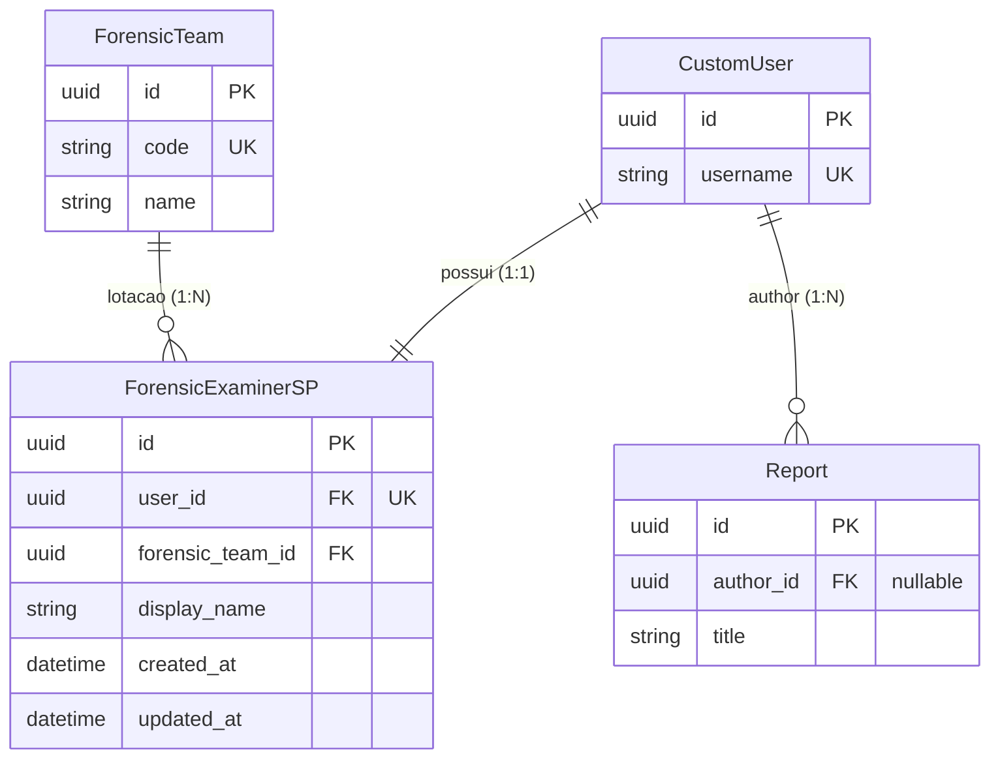
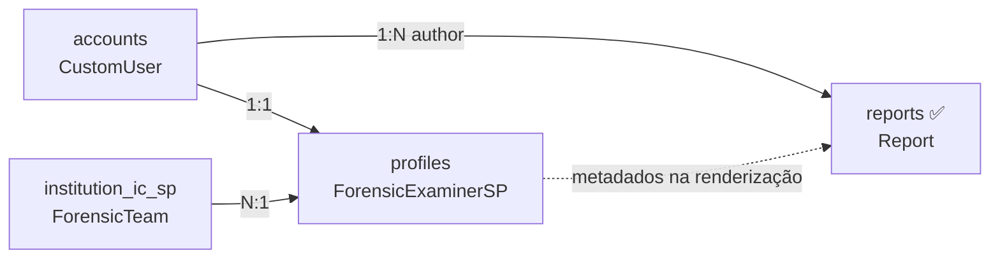

# App `profiles` — Perfil do perito criminal (SP)

Cadastro do **perfil profissional** do perito criminalístico de São Paulo:
vínculo com login, nome de exibição em laudos e lotação em equipe pericial.

> **Decisão:** [ADR-0007](../decisions/0007-forensic-examiner-sp.md)

---

## Propósito

| Aspecto | Descrição |
|---|---|
| **Problema** | Autenticação (`CustomUser`) não carrega lotação nem nome pericial para laudos |
| **Solução** | Model `ForensicExaminerSP` 1:1 com usuário, FK para `ForensicTeam` |
| **Fora do escopo** | Autenticação, cadastro institucional, conteúdo de laudos |
| **Consumidor** | `reports.Report` referencia `CustomUser` como autor; metadados periciais (`display_name`, lotação) enriquecem laudos na renderização |

---

## Estrutura do app

```
profiles/
├── admin/
│   └── forensic_examiner_sp_admin.py
├── forms/                         # reservado para telas de edição
├── models/
│   └── forensic_examiner_sp.py
├── services/                      # regras de criação/validação futuras
├── static/profiles/               # namespace: 
├── templates/profiles/            # namespace: profiles/...
├── tests/
│   └── test_forensic_examiner_sp.py
├── migrations/
│   └── 0001_initial.py
├── urls.py                        # app_name = "profiles"
└── views/                         # CBVs futuras
```

---

## Model `ForensicExaminerSP`

Perfil profissional do perito criminal de SP. Herda `BaseModel` (UUID + timestamps).

| Campo | Tipo | Descrição |
|---|---|---|
| `user` | OneToOne → `CustomUser` | Usuário autenticado (`related_name="forensic_examiner_sp"`) |
| `display_name` | CharField(255) | Nome de exibição na assinatura do laudo |
| `forensic_team` | FK → `ForensicTeam` | Equipe de lotação (`related_name="examiners"`, `PROTECT`) |

**Meta:**

| Propriedade | Valor |
|---|---|
| `verbose_name` | Perito criminal (SP) |
| `verbose_name_plural` | Peritos criminais (SP) |
| `ordering` | `display_name` |

---

## Relacionamentos



### Cardinalidades

| Relação | Tipo | Descrição |
|---|---|---|
| `CustomUser` → `ForensicExaminerSP` | 1:1 | Cada usuário tem no máximo um perfil pericial SP |
| `ForensicTeam` → `ForensicExaminerSP` | 1:N | Vários peritos na mesma equipe; cada perito em uma equipe |
| `CustomUser` → `Report` | 1:N | Autor do relatório (app `reports`; ver [07-reports.md](./07-reports.md)) |

### Núcleo pericial

Não há FK direta para `ForensicNucleus`. O núcleo é acessado por:

```python
examiner.forensic_team.nucleus
```

---

## Regras de negócio

| Regra | Implementação |
|---|---|
| Um perfil por usuário | `OneToOneField` em `user` |
| Lotação obrigatória | `forensic_team` não nullable |
| Proteger equipe com peritos | `on_delete=PROTECT` em `forensic_team` |
| Nome no laudo independente do login | `display_name` separado de `user.first_name` |

Testes em `profiles/tests/test_forensic_examiner_sp.py`.

---

## Integração Django

| Item | Valor |
|---|---|
| `INSTALLED_APPS` | `'profiles'` (após `institution_ic_sp`) |
| URLs | `/profiles/` — namespace `profiles` (sem views ainda) |
| Admin | `ForensicExaminerSPAdmin` com autocomplete em `user` e `forensic_team` |
| Acesso reversos | `user.forensic_examiner_sp`, `team.examiners` |

### Dependências



---

## Administração

No Django Admin, cadastre peritos em **Peritos criminais (SP)**:

1. Selecione o `CustomUser` (autocomplete).
2. Informe o **Nome de exibição no laudo**.
3. Escolha a **Equipe pericial** (`ForensicTeam` do seed IC-SP).

Equipes embutidas (DHPP, DEIC, DETRAN) também estão disponíveis no seed.

---

## Escopo futuro

- [ ] CBV de edição de perfil pelo próprio perito
- [ ] Signal ou serviço pós-registro para criar perfil automaticamente
- [ ] Campos opcionais: registro funcional, classe, matrícula
- [ ] Enriquecimento de laudos com lotação e `display_name` na renderização ([07-reports.md](./07-reports.md))
- [ ] Extensão gov.br: CPF/`sub` OIDC em `CustomUser` ([ADR-0003](../decisions/0003-govbr-authentication.md))

---

## Referências

- [ADR-0007: ForensicExaminerSP](../decisions/0007-forensic-examiner-sp.md)
- [App institution_ic_sp](./04-institution-ic-sp.md)
- [Modelo de dados — ERD](./02-data-model.md)
- [Mapa de apps](./03-apps-map.md)
