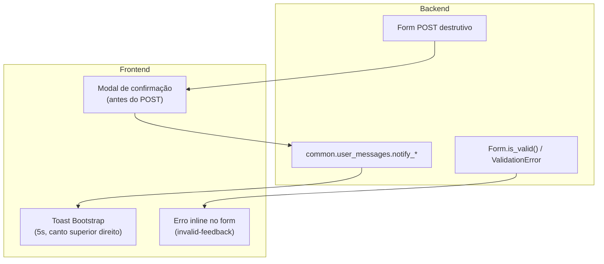
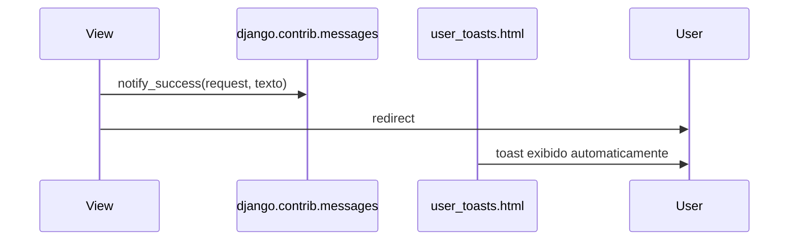

# reportline/docs/architecture/06-user-messaging.md
# Mensagens ao usuário — padrão transversal

Convenção centralizada de **feedback visual** ao usuário final do ReportLine: mensagens
flash temporárias (toasts), erros de formulário inline e confirmações via modal.

> **Enforcement no código:** regra Cursor `.cursor/rules/messaging-standards.mdc`

---

## Propósito

| Aspecto | Descrição |
|---|---|
| **Problema** | Cada feature poderia implementar alerts, estilos e confirmações de forma diferente |
| **Solução** | API Python única (`common.user_messages`) + partials globais no layout base |
| **Fora do escopo** | Notificações persistentes (sino/caixa de entrada), validação server-side em si |
| **Consumidores** | Todos os apps com views que redirecionam após POST ou ações destrutivas |

---

## Três tipos de feedback

Cada tipo tem canal de exibição fixo — **não misturar**.



| Tipo | Quando usar | Como exibir | Exemplo |
|---|---|---|---|
| **Flash** | Após POST + redirect; feedback de operação concluída ou falha | Toast temporário | `"Laudo salvo com sucesso."` |
| **Validação** | Erro no mesmo request, antes do redirect | Inline no formulário | Senha inválida no login |
| **Confirmação** | Ação destrutiva ou irreversível | Modal Bootstrap | Excluir laudo |

---

## Arquitetura de arquivos

```
common/
└── user_messages.py              # API notify_success | notify_error | notify_warning | notify_info

templates/
├── base.html                     # inclui toasts + modal + scripts
└── includes/
    ├── user_toasts.html          # renderização dos flash messages
    ├── confirm_modal.html        # modal global reutilizável
    ├── confirm_action_button.html # botão pronto para forms POST
    └── confirm_action_scripts.html # JS de interceptação data-confirm-action

common/tests/
└── test_user_messages.py         # garante níveis corretos no Django messages
```

**Stack:** Django `contrib.messages` (transporte) + Bootstrap 5.3 Toasts/Modal (apresentação).
Sem bibliotecas JavaScript adicionais.

---

## API Python — flash messages

Importar **sempre** de `common.user_messages`. Não usar `django.contrib.messages` diretamente
em views, adapters ou services de domínio.

```python
from common.user_messages import notify_success, notify_error

def my_view(request):
    # ... persistência ...
    notify_success(request, "Laudo salvo com sucesso.")
    return redirect("reports:detail", pk=report.pk)
```

| Função | Nível Django | Cor do toast | Ícone |
|---|---|---|---|
| `notify_success` | `success` | verde | `bi-check-circle-fill` |
| `notify_error` | `error` | vermelho | `bi-exclamation-triangle-fill` |
| `notify_warning` | `warning` | amarelo | `bi-exclamation-circle-fill` |
| `notify_info` | `info` | azul | `bi-info-circle-fill` |

Textos **sempre em português**, claros e voltados ao usuário final.

---

## Toasts — renderização global

Incluídos automaticamente em `templates/base.html` via `includes/user_toasts.html`.

- Posição: canto superior direito (`position-fixed top-0 end-0`)
- Duração: 5 segundos (`data-bs-delay="5000"`)
- Fechamento manual: botão ✕
- Inicialização: script em `base.html`, **após** o bundle Bootstrap

Fluxo típico:



---

## Validação de formulário — inline

Erros de campo e `non_field_errors` **não** passam pelo sistema de toasts.

Padrão Bootstrap no template do form:

```django

    <div class="alert alert-danger" role="alert">
        {{ form.non_field_errors }}
    </div>


<input class="form-control is-invalid" ...>
<div class="invalid-feedback">{{ form.email.errors.0 }}</div>
```

Referência existente: `accounts/templates/accounts/includes/local_login_form.html`.

---

## Modal de confirmação

Para ações destrutivas ou irreversíveis. Modal global em `base.html`; o desenvolvedor
só adiciona o trigger no template da feature.

### Forma recomendada (botão dentro do form POST)

```django
<form method="post" action="">
    
    
</form>
```

### Form separado do botão

```django
<button type="button"
        class="btn btn-danger"
        data-confirm-action
        data-confirm-form="#delete-report-form"
        data-confirm-title="Excluir laudo"
        data-confirm-message="Esta ação não pode ser desfeita."
        data-confirm-label="Excluir laudo">
    Excluir
</button>

<form id="delete-report-form" method="post" action="...">
    
</form>
```

### Atributos `data-confirm-*`

| Atributo | Obrigatório | Padrão | Descrição |
|---|---|---|---|
| `data-confirm-action` | sim | — | Marca o elemento como trigger |
| `data-confirm-title` | não | `"Confirmar ação"` | Título do modal |
| `data-confirm-message` | não | `"Tem certeza que deseja continuar?"` | Corpo principal |
| `data-confirm-detail` | não | — | Texto destacado (ex.: nome do item) |
| `data-confirm-label` | não | `"Confirmar"` | Rótulo do botão de confirmação |
| `data-confirm-variant` | não | `"danger"` | Variante Bootstrap do botão (`danger`, `warning`…) |
| `data-confirm-form` | não | form pai | Seletor CSS do form a submeter |

Após confirmação e processamento no backend, usar `notify_success` ou `notify_error` para o feedback final.

---

## O que evitar

| ❌ Evitar | ✅ Usar |
|---|---|
| `django.contrib.messages` direto nos apps | `common.user_messages.notify_*` |
| Toast para erro de validação de form | `invalid-feedback` inline |
| Toast para “Tem certeza que deseja excluir?” | Modal de confirmação |
| `alert()` JavaScript | Toasts ou modal Bootstrap |
| Markup ad hoc de alerta/toast | Partials em `templates/includes/` |
| App Django dedicado só para mensagens | Módulo `common.user_messages` + partials |

---

## Evolução futura (não implementado)

| Necessidade | Direção provável |
|---|---|
| Notificações persistentes (sino, histórico) | App `notifications` com model no banco |
| Feedback em requests AJAX/HTMX | Fragmento HTML do toast + header `HX-Trigger` |
| Modais mais elaborados | Avaliar SweetAlert2; hoje Bootstrap cobre o caso |

---

## Referências

- [Mapa de apps — app `common`](./03-apps-map.md#common-)
- [Regra Cursor — messaging-standards](../../.cursor/rules/messaging-standards.mdc)
- [Templates — convenções](../../.cursor/rules/django-templates.mdc)
