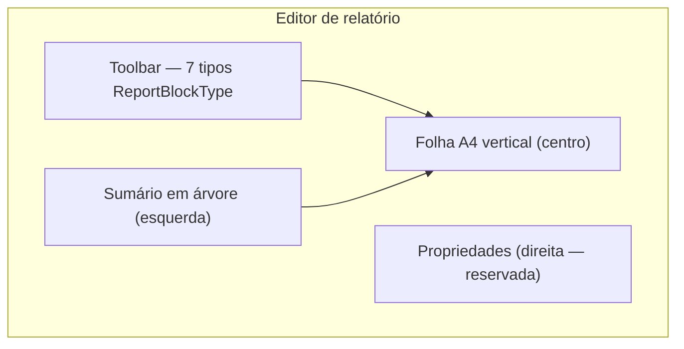
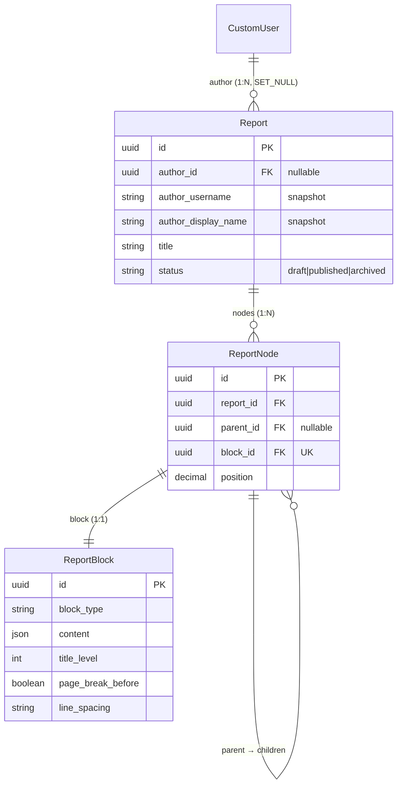

# App `reports` — Relatórios modulares

Composição de **relatórios genéricos** por árvore de nós e blocos de conteúdo
tipados. Base para laudos periciais e outros documentos produzidos no ReportLine.

> **Decisão:** [ADR-0002](../decisions/0002-report-node-structure.md)

---

## Propósito

| Aspecto | Descrição |
|---|---|
| **Problema** | Documentos periciais exigem seções aninhadas, tipos de conteúdo distintos e formatação consistente |
| **Solução** | `Report` + árvore `ReportNode` + bloco genérico `ReportBlock` 1:1 por nó |
| **Fora do escopo (fase atual)** | Inserção/movimentação interativa de blocos, renderização PDF, templates de laudo pericial específicos |
| **Consumidor futuro** | Camada de laudo pericial (mapeia papéis semânticos → blocos genéricos) |

---

## Estrutura do app

```
reports/
├── admin/
│   ├── report_admin.py
│   ├── report_block_admin.py
│   └── report_node_admin.py
├── forms/
│   └── report_form.py              # ReportCreateForm
├── models/
│   ├── report.py
│   ├── report_node.py
│   └── report_block.py
├── services/
│   ├── author_snapshot.py          # snapshot textual do autor
│   ├── report_creation.py          # criação de relatório em rascunho
│   └── report_editor_context.py    # sumário e corpo para o editor
├── signals.py                      # cascata nó→bloco; snapshot na exclusão do user
├── static/reports/
│   └── css/report_editor.css
├── templates/reports/
│   ├── report_form.html            # novo relatório
│   ├── report_editor.html          # editor visual
│   └── includes/                   # toolbar, sumário, folha A4, preview de bloco
├── tests/
│   ├── test_report_models.py
│   ├── test_report_block.py
│   ├── test_report_creation.py
│   ├── test_report_create_views.py
│   ├── test_report_editor_context.py
│   └── test_report_editor_views.py
├── migrations/
│   └── 0001_initial.py
├── urls.py                         # app_name = "reports"
└── views/
    ├── report_create_views.py      # ReportCreateView
    └── report_editor_views.py      # ReportEditorView
```

---

## Integração Django

| Item | Valor |
|---|---|
| `INSTALLED_APPS` | `'reports'` |
| URLs raiz | `path('reports/', include('reports.urls'))` em `reportline/urls.py` |
| Namespace | `reports` |
| Autenticação | `LoginRequiredMixin` em todas as CBVs de usuário final |

---

## Rotas HTTP

| Rota | Name | View | Descrição |
|---|---|---|---|
| `GET/POST /reports/new/` | `reports:new` | `ReportCreateView` | Formulário de título; cria rascunho e redireciona ao editor |
| `GET /reports/<uuid:pk>/edit/` | `reports:edit` | `ReportEditorView` | Editor visual do relatório (somente autor) |

**Fluxo de criação:**

1. Usuário autenticado acessa `/reports/new/` e informa o título.
2. Serviço `create_report()` persiste `Report` com `status=draft` e snapshot do autor.
3. Redirect para `/reports/<pk>/edit/` com toast de sucesso.

Um relatório **pode existir sem nós** — blocos são adicionados posteriormente (toolbar interativa ou admin).

---

## Views

### `ReportCreateView`

- **Template:** `reports/report_form.html`
- **Formulário:** `ReportCreateForm` (campo `title`)
- **Persistência:** delegada a `create_report()`; não chama `form.save()` do model
- **Sucesso:** `notify_success` + redirect para `reports:edit`

### `ReportEditorView`

- **Template:** `reports/report_editor.html`
- **Permissão:** queryset restrito a `Report.objects.filter(author=request.user)` — demais usuários recebem 404
- **Contexto:** enriquecido por `build_report_editor_context()` com `outline_tree` e `body_entries`

---

## Serviços

### `create_report(author, title)`

Cria relatório em rascunho vinculado ao autor. O snapshot textual (`author_username`, `author_display_name`) é preenchido pelo `save()` do model `Report`.

### `build_report_editor_context(report)`

Monta estruturas para os partials do editor:

| Chave | Tipo | Descrição |
|---|---|---|
| `outline_tree` | `list[ReportOutlineEntry]` | Sumário hierárquico com blocos `heading` apenas; nós intermediários de outros tipos são ignorados, mas descendentes títulos permanecem no nível correto |
| `body_entries` | `list[ReportBodyEntry]` | Todos os blocos em ordem profundidade-primeiro para renderização na folha A4 |

---

## Interface do editor

Layout de três colunas com toolbar superior. Navbar global do `base.html` permanece visível; o template sobrescreve `` para layout full-width.



| Região | Implementação | Estado |
|---|---|---|
| Toolbar | Ícones Bootstrap Icons para os 7 `ReportBlockType` | UI pronta; botões desabilitados até camada interativa |
| Sumário | Partial recursivo `report_outline_tree.html` | Dados reais via `outline_tree` |
| Corpo | Folha simulada (`210mm × 297mm`, fundo branco) | Preview estático dos blocos via `body_entries` |
| Propriedades | Coluna direita vazia | Reservada para layout/paginação do bloco |

**Responsividade:** abaixo de **992px**, toolbar e laterais são ocultadas; permanece visível apenas a folha central.

**Partials:**

- `includes/report_editor_toolbar.html`
- `includes/report_outline_tree.html` / `report_outline_item.html`
- `includes/report_page_body.html`
- `includes/report_block_preview.html`

**Estilos:** `static/reports/css/report_editor.css`

---

## Models

### `Report`

Relatório modular. Herda `BaseModel` (UUID + timestamps).

| Campo | Tipo | Descrição |
|---|---|---|
| `author` | FK → `CustomUser`, nullable | Autor; `SET_NULL` na exclusão da conta |
| `author_username` | CharField(150) | Snapshot do username |
| `author_display_name` | CharField(255) | Snapshot do nome exibido |
| `title` | CharField(255) | Título do relatório |
| `status` | CharField | `draft` \| `published` \| `archived` |

**Regras:**

- `save()` atualiza snapshot enquanto `author` estiver vinculado.
- Signal `pre_delete` em `CustomUser` reforça snapshot antes do `SET_NULL`.
- Property `author_label` retorna autor ativo ou snapshot.

### `ReportNode`

Nó na árvore de composição. Herda `BaseModel`.

| Campo | Tipo | Descrição |
|---|---|---|
| `report` | FK → `Report` | Relatório pai (`CASCADE`) |
| `parent` | FK → self, nullable | Pai na árvore; `null` = raiz |
| `block` | OneToOne → `ReportBlock` | Conteúdo renderizado pelo nó |
| `position` | DecimalField | Ordem entre irmãos (indexação fracionária) |

**Regras:**

- Índice `(report, parent, position)` para consultas de ordenação.
- Signal `post_delete` remove o `ReportBlock` associado (evita órfãos).

### `ReportBlock`

Bloco genérico de conteúdo. Herda `BaseModel`.

| Campo | Tipo | Descrição |
|---|---|---|
| `block_type` | CharField | Tipo de conteúdo (ver tabela abaixo) |
| `content` | JSONField | Payload específico do tipo |
| `title_level` | PositiveSmallIntegerField | Nível hierárquico do título (0–9); blocos `heading` |
| `page_break_before` | BooleanField | Quebrar página antes |
| `keep_with_previous` | BooleanField | Manter com bloco anterior |
| `keep_with_next` | BooleanField | Manter com bloco posterior |
| `indent_paragraph` | BooleanField | Identar parágrafo |
| `first_line_indent` | BooleanField | Recuar primeira linha |
| `line_spacing` | CharField | `compact` \| `normal` \| `relaxed` |
| `space_before` | PositiveSmallIntegerField | Espaço antes (pt) |
| `space_after` | PositiveSmallIntegerField | Espaço após (pt) |

#### Tipos de bloco (`ReportBlockType`)

| Valor | Descrição | Exemplo de `content` |
|---|---|---|
| `heading` | Título | `{"text": "Introdução"}` + `title_level` |
| `paragraph` | Parágrafo | `{"text": "Corpo do texto."}` |
| `link` | Link | `{"text": "Rótulo", "url": "https://..."}` |
| `ordered_list` | Lista numerada | `{"items": ["A", "B"]}` |
| `unordered_list` | Lista com marcadores | `{"items": ["A", "B"]}` |
| `table` | Tabela | `{"headers": [...], "rows": [...]}` |
| `image` | Imagem | `{"alt": "...", "file": "..."}` |

Opções de layout aplicam-se a **todos** os tipos; a interpretação visual completa fica na camada de renderização (futura).

#### Exemplo futuro — número do laudo pericial

```python
ReportBlock(
    block_type=ReportBlockType.HEADING,
    title_level=0,
    content={"text": "123/2026"},
    position=...,  # via ReportNode
)
```

---

## Diagrama de relacionamentos



---

## Dependências

| Dependência | Motivo |
|---|---|
| `accounts.CustomUser` | Autor do relatório |
| `common.BaseModel` | UUID e timestamps |
| `common.user_messages` | Toasts de sucesso na criação |

Não depende de `profiles` nem `institution_ic_sp` no model layer; metadados
periciais podem ser enriquecidos na renderização via perfil do autor.

---

## Admin

Models registrados no Django Admin:

- `Report` — listagem com `author_label_display`
- `ReportNode` — árvore e posição
- `ReportBlock` — tipo, conteúdo e fieldset **Layout e paginação**

Útil para compor nós/blocos enquanto a toolbar interativa não estiver disponível.

---

## Testes

| Arquivo | Cobertura |
|---|---|
| `test_report_models.py` | Report, ReportNode, snapshot do autor, cascata |
| `test_report_block.py` | Tipos de bloco, defaults de layout |
| `test_report_creation.py` | Serviço `create_report`, rascunho, snapshot |
| `test_report_create_views.py` | Formulário `/reports/new/`, redirect, erros inline |
| `test_report_editor_context.py` | Sumário, ordem do corpo, árvore de títulos |
| `test_report_editor_views.py` | Editor, permissão de autor, layout |

Executar: `python manage.py test reports`

---

## Próximos passos

- [x] CBV de criação de relatório (`/reports/new/`)
- [x] CBV de edição visual (`/reports/<pk>/edit/`) — shell do editor
- [x] Serviço de contexto do editor (sumário + corpo)
- [ ] CBV de listagem de relatórios do autor
- [ ] Serviço de árvore (inserir, mover, reordenar nós)
- [ ] Toolbar interativa (inserção de blocos via POST/API)
- [ ] Painel de propriedades do bloco (layout e paginação)
- [ ] Validação de `content` por `block_type`
- [ ] Camada de laudo pericial (mapeamento semântico → blocos genéricos)
- [ ] Renderização PDF/HTML com opções de layout

---

## Referências

- [ADR-0002](../decisions/0002-report-node-structure.md)
- [Modelo de dados](./02-data-model.md)
- [Mapa de apps](./03-apps-map.md)
- [App profiles](./05-profiles.md)
- [Mensagens ao usuário](./06-user-messaging.md)
