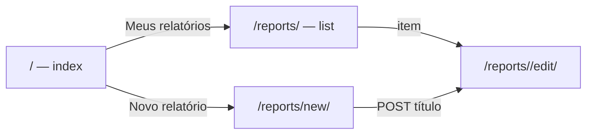
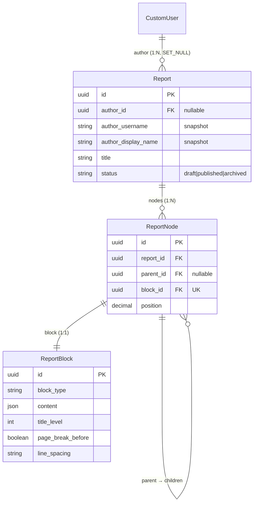

# App `reports` — Relatórios modulares

Composição de **relatórios genéricos** por árvore de nós e blocos de conteúdo
tipados. Base para laudos periciais e outros documentos produzidos no ReportLine.

> **Decisão:** [ADR-0002](../decisions/0002-report-node-structure.md)

---

## Propósito

| Aspecto | Descrição |
|---|---|
| **Problema** | Documentos periciais exigem seções aninhadas, tipos de conteúdo distintos e formatação consistente |
| **Solução** | `Report` + árvore `ReportNode` + bloco genérico `ReportBlock` 1:1 por nó |
| **Fora do escopo (fase atual)** | Exclusão/merge de blocos (Backspace), mover nós na árvore, edição interativa de tabela/link, upload de imagem, renderização PDF, templates de laudo pericial específicos |
| **Consumidor futuro** | Camada de laudo pericial (mapeia papéis semânticos → blocos genéricos) |

---

## Evolução implementada

| Fase | Entrega |
|---|---|
| **1 — Models** | `Report`, `ReportNode`, `ReportBlock`; admin; testes de domínio e cascata |
| **2 — Editor (shell)** | Layout toolbar + sumário + folha central + barra de propriedades; CBV de edição |
| **3 — Criação** | `/reports/new/`, serviço `create_report`, redirect ao editor |
| **4 — Editor interativo** | Blocos `contenteditable`, Enter/Shift+Enter, autosave, API JSON, bootstrap H1 |
| **5 — Hub do usuário** | `/reports/` (listagem), cards na página inicial (`index`) |

---

## Estrutura do app

```
reports/
├── admin/
│   ├── report_admin.py
│   ├── report_block_admin.py
│   └── report_node_admin.py
├── forms/
│   └── report_form.py
├── models/
│   ├── report.py
│   ├── report_node.py
│   └── report_block.py
├── services/
│   ├── author_snapshot.py
│   ├── report_creation.py
│   ├── report_editor_bootstrap.py
│   ├── report_editor_context.py
│   ├── report_block_content.py
│   ├── report_block_sequence.py
│   └── report_tree.py
├── signals.py
├── static/reports/
│   ├── css/report_editor.css
│   └── js/report_editor.js
├── templates/reports/
│   ├── report_form.html
│   ├── report_list.html
│   ├── report_editor.html
│   └── includes/
│       ├── report_block_editable.html
│       ├── report_editor_toolbar.html
│       ├── report_outline_tree.html
│       ├── report_outline_item.html
│       └── report_page_body.html
├── tests/
│   ├── test_report_models.py
│   ├── test_report_block.py
│   ├── test_report_creation.py
│   ├── test_report_create_views.py
│   ├── test_report_list_views.py
│   ├── test_report_editor_bootstrap.py
│   ├── test_report_editor_context.py
│   ├── test_report_editor_views.py
│   ├── test_report_block_content.py
│   ├── test_report_tree.py
│   └── test_report_node_api_views.py
├── migrations/
│   └── 0001_initial.py
├── urls.py
└── views/
    ├── report_create_views.py
    ├── report_list_views.py
    ├── report_editor_views.py
    └── report_node_api_views.py
```

---

## Integração Django

| Item | Valor |
|---|---|
| `INSTALLED_APPS` | `'reports'` |
| URLs raiz | `path('reports/', include('reports.urls'))` em `reportline/urls.py` |
| Namespace | `reports` |
| Autenticação | `LoginRequiredMixin` em todas as CBVs de usuário final |
| Página inicial | `templates/index.html` — cards **Meus relatórios** e **Novo relatório** (usuário autenticado) |

---

## Rotas HTTP

| Rota | Name | View | Descrição |
|---|---|---|---|
| `GET /reports/` | `reports:list` | `ReportListView` | Listagem dos relatórios do autor |
| `GET/POST /reports/new/` | `reports:new` | `ReportCreateView` | Formulário de título; cria rascunho e redireciona ao editor |
| `GET /reports/<uuid:pk>/edit/` | `reports:edit` | `ReportEditorView` | Editor visual (somente autor) |
| `POST /reports/<uuid:pk>/nodes/` | `reports:node_create` | `ReportNodeCreateView` | Insere nó irmão após bloco atual (JSON) |
| `PATCH /reports/<uuid:pk>/nodes/<uuid:node_id>/` | `reports:node_update` | `ReportNodeDetailView` | Atualiza conteúdo do bloco ou estende lista (JSON) |

### Fluxo pós-login



### Fluxo de criação

1. Usuário autenticado acessa `/reports/new/` (ou card na home) e informa o título.
2. Serviço `create_report()` persiste `Report` com `status=draft` e snapshot do autor.
3. Redirect para `/reports/<pk>/edit/` com toast de sucesso.
4. Se o relatório não possui nós, `ensure_editor_bootstrap()` cria título H1 vazio com foco.

---

## Views

### `ReportListView`

- **Template:** `reports/report_list.html`
- **Queryset:** `Report.objects.filter(author=request.user).order_by("-created_at")`
- **Paginação:** 20 itens por página
- **Empty state:** mensagem + link para `reports:new`
- **Itens:** link direto para `reports:edit`

### `ReportCreateView`

- **Template:** `reports/report_form.html`
- **Formulário:** `ReportCreateForm` (campo `title`)
- **Persistência:** delegada a `create_report()`; não chama `form.save()` do model
- **Sucesso:** `notify_success` + redirect para `reports:edit`

### `ReportEditorView`

- **Template:** `reports/report_editor.html`
- **Bootstrap:** `ensure_editor_bootstrap()` em `get_object()` quando árvore vazia
- **Permissão:** queryset restrito ao autor — demais usuários recebem 404
- **Contexto:** `outline_tree`, `body_entries`, `autofocus_node_id`
- **JS:** `report_editor.js` inicializado via `extra_js`

### `ReportNodeCreateView` / `ReportNodeDetailView`

- **Formato:** JSON (`JsonResponse`)
- **Autorização:** relatório deve pertencer ao usuário autenticado
- **POST:** cria irmão após `after_node_id`; retorna HTML renderizado do novo bloco
- **PATCH:** atualiza `content`; suporta `append_list_item` para listas

---

## Serviços

| Serviço | Arquivo | Função |
|---|---|---|
| Snapshot do autor | `author_snapshot.py` | Texto preservado após exclusão de conta |
| Criação | `report_creation.py` | `create_report(author, title)` |
| Bootstrap | `report_editor_bootstrap.py` | H1 vazio quando relatório sem nós |
| Contexto do editor | `report_editor_context.py` | Sumário + corpo; `render_editable_block_html()` |
| Conteúdo | `report_block_content.py` | Normalização/validação de `content` por tipo |
| Sequência | `report_block_sequence.py` | Próximo tipo de bloco após Enter |
| Árvore | `report_tree.py` | `update_node_block`, `insert_sibling_after`, `append_list_item` |

### Regras de Enter (editor)

| Bloco atual | Enter |
|---|---|
| `heading` | Salva → novo `paragraph` |
| `paragraph` | Salva → novo `paragraph` |
| `ordered_list` / `unordered_list` | Salva → novo **item no mesmo nó** |
| `image` | Salva → `paragraph` de legenda |
| Demais | Salva → `paragraph` (padrão) |

**Shift+Enter:** quebra de linha dentro do mesmo bloco (`\n` no JSON).

**Autosave:** debounce (~1,5 s) em `input` + save garantido no Enter.

**Toolbar:** insere bloco do tipo escolhido após o nó focado (via POST).

---

## Interface do editor

Layout de três colunas com toolbar superior. Navbar global permanece visível;
`` sobrescreve o container para layout full-width.

| Região | Estado |
|---|---|
| Toolbar | Ativa — 7 tipos `ReportBlockType` |
| Sumário | Títulos em árvore; atualização client-side ao salvar heading |
| Corpo | Blocos editáveis; painel central ocupa toda a coluna |
| Propriedades | Reservada (layout/paginação futura) |

**Visual:** variáveis CSS `--report-page-*` por tema (claro/escuro); folha sem borda externa.

**Responsividade:** abaixo de **992px**, toolbar e laterais ocultas; só o corpo central.

**Assets:** `static/reports/css/report_editor.css`, `static/reports/js/report_editor.js`

---

## Models

### `Report`

Relatório modular. Herda `BaseModel` (UUID + timestamps).

| Campo | Tipo | Descrição |
|---|---|---|
| `author` | FK → `CustomUser`, nullable | Autor; `SET_NULL` na exclusão da conta |
| `author_username` | CharField(150) | Snapshot do username |
| `author_display_name` | CharField(255) | Snapshot do nome exibido |
| `title` | CharField(255) | Título do relatório |
| `status` | CharField | `draft` \| `published` \| `archived` |

**Regras:**

- `save()` atualiza snapshot enquanto `author` estiver vinculado.
- Signal `pre_delete` em `CustomUser` reforça snapshot antes do `SET_NULL`.
- Property `author_label` retorna autor ativo ou snapshot.

### `ReportNode`

Nó na árvore de composição. Herda `BaseModel`.

| Campo | Tipo | Descrição |
|---|---|---|
| `report` | FK → `Report` | Relatório pai (`CASCADE`) |
| `parent` | FK → self, nullable | Pai na árvore; `null` = raiz |
| `block` | OneToOne → `ReportBlock` | Conteúdo renderizado pelo nó |
| `position` | DecimalField | Ordem entre irmãos (indexação fracionária) |

**Regras:**

- Índice `(report, parent, position)` para consultas de ordenação.
- Signal `post_delete` remove o `ReportBlock` associado (evita órfãos).

### `ReportBlock`

Bloco genérico de conteúdo. Herda `BaseModel`.

| Campo | Tipo | Descrição |
|---|---|---|
| `block_type` | CharField | Tipo de conteúdo (ver tabela abaixo) |
| `content` | JSONField | Payload específico do tipo |
| `title_level` | PositiveSmallIntegerField | Nível hierárquico do título (0–9); blocos `heading` |
| `page_break_before` | BooleanField | Quebrar página antes |
| `keep_with_previous` | BooleanField | Manter com bloco anterior |
| `keep_with_next` | BooleanField | Manter com bloco posterior |
| `indent_paragraph` | BooleanField | Identar parágrafo |
| `first_line_indent` | BooleanField | Recuar primeira linha |
| `line_spacing` | CharField | `compact` \| `normal` \| `relaxed` |
| `space_before` | PositiveSmallIntegerField | Espaço antes (pt) |
| `space_after` | PositiveSmallIntegerField | Espaço após (pt) |

#### Tipos de bloco (`ReportBlockType`)

| Valor | Descrição | Exemplo de `content` |
|---|---|---|
| `heading` | Título | `{"text": "Introdução"}` + `title_level` |
| `paragraph` | Parágrafo | `{"text": "Corpo do texto."}` |
| `link` | Link | `{"text": "Rótulo", "url": "https://..."}` |
| `ordered_list` | Lista numerada | `{"items": ["A", "B"]}` |
| `unordered_list` | Lista com marcadores | `{"items": ["A", "B"]}` |
| `table` | Tabela | `{"headers": [...], "rows": [...]}` |
| `image` | Imagem | `{"alt": "...", "file": "..."}` |

Opções de layout aplicam-se a **todos** os tipos; interpretação completa na renderização futura (PDF/HTML).

---

## Diagrama de relacionamentos



---

## Dependências

| Dependência | Motivo |
|---|---|
| `accounts.CustomUser` | Autor do relatório |
| `common.BaseModel` | UUID e timestamps |
| `common.user_messages` | Toasts de sucesso |

Não depende de `profiles` nem `institution_ic_sp` no model layer.

---

## Admin

Models registrados no Django Admin (complementar à UI web):

- `Report` — listagem com `author_label_display`
- `ReportNode` — árvore e posição
- `ReportBlock` — tipo, conteúdo e fieldset **Layout e paginação**

---

## Testes

| Arquivo | Cobertura |
|---|---|
| `test_report_models.py` | Report, ReportNode, snapshot, cascata |
| `test_report_block.py` | Tipos de bloco, defaults de layout |
| `test_report_creation.py` | Serviço `create_report` |
| `test_report_create_views.py` | Formulário `/reports/new/` |
| `test_report_list_views.py` | Listagem, home com cards, permissões |
| `test_report_editor_bootstrap.py` | H1 inicial em relatório vazio |
| `test_report_editor_context.py` | Sumário e ordem do corpo |
| `test_report_editor_views.py` | Editor, bootstrap, layout |
| `test_report_block_content.py` | Normalização e sequência de blocos |
| `test_report_tree.py` | Inserção, atualização, listas |
| `test_report_node_api_views.py` | API PATCH/POST |

Executar: `python manage.py test reports`

---

## Próximos passos

- [x] Models, admin e testes de domínio
- [x] CBV de listagem (`/reports/`)
- [x] CBV de criação (`/reports/new/`)
- [x] CBV de edição visual (`/reports/<pk>/edit/`)
- [x] Editor interativo (Enter, autosave, toolbar, API JSON)
- [x] Hub na página inicial (cards pós-login)
- [ ] Excluir/merge de blocos vazios (Backspace)
- [ ] Mover/reordenar nós na árvore (drag-and-drop ou comandos)
- [ ] Edição interativa de link e tabela
- [ ] Upload de imagem
- [ ] Painel de propriedades do bloco (layout e paginação)
- [ ] Publicação/arquivamento na UI
- [ ] Camada de laudo pericial (mapeamento semântico → blocos)
- [ ] Renderização PDF/HTML

---

## Referências

- [ADR-0002](../decisions/0002-report-node-structure.md)
- [Modelo de dados](./02-data-model.md)
- [Mapa de apps](./03-apps-map.md)
- [Contexto do sistema](./01-context.md)
- [App profiles](./05-profiles.md)
- [Mensagens ao usuário](./06-user-messaging.md)
