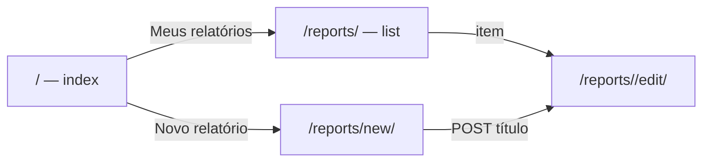
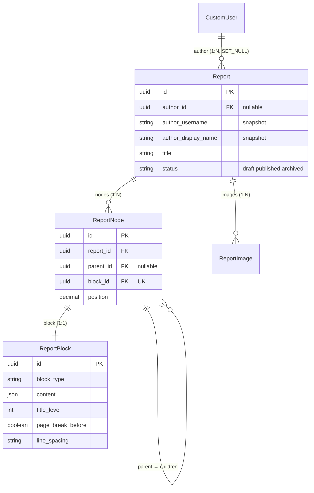

# App `reports` — Relatórios modulares

Composição de **relatórios genéricos** por árvore de nós e blocos de conteúdo
tipados. Base para laudos periciais e outros documentos produzidos no ReportLine.

> **Decisão:** [ADR-0002](../decisions/0002-report-node-structure.md)

---

## Propósito

| Aspecto | Descrição |
|---|---|
| **Problema** | Documentos periciais exigem seções aninhadas, tipos de conteúdo distintos e formatação consistente |
| **Solução** | `Report` + árvore `ReportNode` + bloco genérico `ReportBlock` 1:1 por nó |
| **Fora do escopo (fase atual)** | Renderização PDF/HTML de leitura, fórmulas matemáticas (KaTeX), painel de propriedades do bloco (layout/paginação por bloco), templates de laudo pericial específicos, publicação/arquivamento na UI |
| **Consumidor futuro** | Camada de laudo pericial (mapeia papéis semânticos → blocos genéricos) |

---

## Evolução implementada

| Fase | Entrega |
|---|---|
| **1 — Models** | `Report`, `ReportNode`, `ReportBlock`; admin; testes de domínio e cascata |
| **2 — Editor (shell)** | Layout toolbar + sumário + folha central + barra de propriedades; CBV de edição |
| **3 — Criação** | `/reports/new/`, serviço `create_report`, redirect ao editor |
| **4 — Editor interativo** | Blocos `contenteditable`, Enter/Shift+Enter, autosave, API JSON, bootstrap H1 |
| **5 — Hub do usuário** | `/reports/` (listagem), cards na página inicial (`index`) |
| **6 — Toolbar e conversão** | Split buttons (título), conversão in-place, inserção em listas, numeração de títulos |
| **7 — Sumário interativo** | Drag-and-drop de títulos, refresh parcial do outline, accordion |
| **8 — Tabelas e imagens** | Inserção de tabela/imagem, estrutura de linhas/colunas, bordas/cabeçalho opcionais, larguras de coluna, resize de imagem, células com imagem |
| **9 — Formatação e links** | Negrito/itálico/sublinhado/sobrescrito/subscrito, alinhamento, recuo, link inline (modal), sanitização HTML bilateral |
| **10 — Layout de página** | Cabeçalho/rodapé tabular (`page_layout` JSON), templates logo+texto, numeração “Página N de T” só no PDF |
| **11 — Configuração do laudo** | Modal: numeração de títulos/legendas, recuo de 1ª linha; API PATCH; preferências do usuário |
| **12 — Linha horizontal e legendas** | Bloco HR, atalho `---`+Enter, parágrafos legenda após imagem, numeração automática de figuras |
| **13 — Undo/redo** | Pilha cliente (Ctrl+Z/Y): texto, blocos, listas, tabelas, imagens, cabeçalho/rodapé, config, reorder sumário |
| **14 — Sumário assíncrono** | DnD sem reload; API reorder retorna ordem do corpo + HTML do sumário; expansão de seções no POST |

> **Próximo marco:** pipeline de renderização HTML paginado → PDF — ver [08-report-document-render.md](./08-report-document-render.md).

---

## Estrutura do app

```
reports/
├── admin/
│   ├── report_admin.py
│   ├── report_block_admin.py
│   └── report_node_admin.py
├── forms/
│   └── report_form.py
├── models/
│   ├── report.py
│   ├── report_node.py
│   ├── report_block.py
│   └── report_image.py
├── services/
│   ├── author_snapshot.py
│   ├── report_block_content.py
│   ├── report_block_image_cleanup.py
│   ├── report_block_sequence.py
│   ├── report_creation.py
│   ├── report_editor_bootstrap.py
│   ├── report_editor_context.py
│   ├── report_heading_numbering.py
│   ├── report_image_processing.py
│   ├── report_image_upload.py
│   ├── report_table_cell_content.py
│   ├── report_table_column_widths.py
│   ├── report_table_structure.py
│   └── report_tree.py
├── signals.py
├── static/reports/
│   ├── css/report_editor.css
│   └── js/
│       ├── report_editor.js
│       ├── report_editor_dev_ipsum.js
│       ├── report_image_insert.js
│       ├── report_image_resize.js
│       ├── report_outline_accordion.js
│       ├── report_outline_dnd.js
│       ├── report_outline_sync.js
│       ├── report_table_column_resize.js
│       ├── report_table_insert.js
│       └── report_table_structure.js
├── templates/reports/
│   ├── report_form.html
│   ├── report_list.html
│   ├── report_editor.html
│   └── includes/
│       ├── report_block_editable.html
│       ├── report_block_preview.html
│       ├── report_editor_toolbar.html
│       ├── report_outline_tree.html
│       ├── report_outline_item.html
│       ├── report_page_body.html
│       ├── report_table_body_cell_editable.html
│       └── report_table_insert_modal.html
├── templatetags/
│   └── report_outline.py
├── tests/
│   ├── test_report_models.py
│   ├── test_report_block.py
│   ├── test_report_block_content.py
│   ├── test_report_creation.py
│   ├── test_report_create_views.py
│   ├── test_report_list_views.py
│   ├── test_report_editor_bootstrap.py
│   ├── test_report_editor_context.py
│   ├── test_report_editor_views.py
│   ├── test_report_heading_numbering.py
│   ├── test_report_image_cleanup.py
│   ├── test_report_image_processing.py
│   ├── test_report_image_upload_api.py
│   ├── test_report_node_api_views.py
│   ├── test_report_outline_tags.py
│   ├── test_report_table_cell_content.py
│   ├── test_report_table_column_widths.py
│   ├── test_report_table_structure.py
│   └── test_report_tree.py
├── migrations/
│   ├── 0001_initial.py
│   └── 0002_report_image.py
├── urls.py
└── views/
    ├── report_create_views.py
    ├── report_editor_views.py
    ├── report_image_api_views.py
    ├── report_list_views.py
    └── report_node_api_views.py
```

---

## Integração Django

| Item | Valor |
|---|---|
| `INSTALLED_APPS` | `'reports'` |
| URLs raiz | `path('reports/', include('reports.urls'))` em `reportline/urls.py` |
| Namespace | `reports` |
| Autenticação | `LoginRequiredMixin` em todas as CBVs de usuário final |
| Página inicial | `templates/index.html` — cards **Meus relatórios** e **Novo relatório** (usuário autenticado) |

---

## Rotas HTTP

| Rota | Name | View | Descrição |
|---|---|---|---|
| `GET /reports/` | `reports:list` | `ReportListView` | Listagem dos relatórios do autor |
| `GET/POST /reports/new/` | `reports:new` | `ReportCreateView` | Formulário de título; cria rascunho e redireciona ao editor |
| `GET /reports/<uuid:pk>/edit/` | `reports:edit` | `ReportEditorView` | Editor visual (somente autor) |
| `GET/PATCH /reports/<uuid:pk>/config/` | `reports:config` | `ReportConfigView` | Configuração do laudo (numeração, recuo) |
| `PATCH /reports/<uuid:pk>/page-layout/` | `reports:page_layout` | `ReportPageLayoutView` | Cabeçalho/rodapé de página (JSON) |
| `GET /reports/<uuid:pk>/outline/` | `reports:outline` | `ReportEditorOutlineView` | HTML parcial do sumário (JSON) |
| `POST /reports/<uuid:pk>/images/upload/` | `reports:image_upload` | `ReportImageUploadView` | Upload multipart de imagem (JSON) |
| `POST /reports/<uuid:pk>/nodes/` | `reports:node_create` | `ReportNodeCreateView` | Insere nó irmão antes/depois de bloco (JSON) |
| `POST /reports/<uuid:pk>/nodes/reorder/` | `reports:node_reorder` | `ReportNodeReorderView` | Reordena títulos irmãos no sumário (JSON) |
| `PATCH /reports/<uuid:pk>/nodes/<uuid:node_id>/` | `reports:node_update` | `ReportNodeDetailView` | Atualiza conteúdo ou tipo do bloco (JSON) |
| `DELETE /reports/<uuid:pk>/nodes/<uuid:node_id>/` | `reports:node_update` | `ReportNodeDetailView` | Remove nó vazio (JSON) |

### Fluxo pós-login



### Fluxo de criação

1. Usuário autenticado acessa `/reports/new/` (ou card na home) e informa o título.
2. Serviço `create_report()` persiste `Report` com `status=draft` e snapshot do autor.
3. Redirect para `/reports/<pk>/edit/` com toast de sucesso.
4. Se o relatório não possui nós, `ensure_editor_bootstrap()` cria título H1 vazio com foco.

---

## Views

### `ReportListView`

- **Template:** `reports/report_list.html`
- **Queryset:** `Report.objects.filter(author=request.user).order_by("-created_at")`
- **Paginação:** 20 itens por página
- **Empty state:** mensagem + link para `reports:new`
- **Itens:** link direto para `reports:edit`

### `ReportCreateView`

- **Template:** `reports/report_form.html`
- **Formulário:** `ReportCreateForm` (campo `title`)
- **Persistência:** delegada a `create_report()`; não chama `form.save()` do model
- **Sucesso:** `notify_success` + redirect para `reports:edit`

### `ReportEditorView`

- **Template:** `reports/report_editor.html`
- **Bootstrap:** `ensure_editor_bootstrap()` em `get_object()` quando árvore vazia
- **Permissão:** queryset restrito ao autor — demais usuários recebem 404
- **Contexto:** `outline_tree`, `body_entries`, `autofocus_node_id`, `max_image_side_px`
- **JS:** módulos em `static/reports/js/` inicializados via `extra_js` (ver seção Interface)

### `ReportEditorOutlineView`

- **GET:** retorna JSON com HTML atualizado do sumário (`render_outline_refresh_payload`)
- **Uso:** sincronização client-side após reorder ou mudanças estruturais

### `ReportImageUploadView`

- **POST:** `multipart/form-data` com campo `image`
- **Resposta:** `image_id`, `file`, `url`, `width`, `height`, `alt`
- **Processamento:** redimensionamento via `report_image_processing` (lado máximo configurável)

### `ReportNodeCreateView` / `ReportNodeDetailView` / `ReportNodeReorderView`

- **Formato:** JSON (`JsonResponse`)
- **Autorização:** relatório deve pertencer ao usuário autenticado
- **POST `node_create`:** cria irmão com `after_node_id` ou `before_node_id`; retorna HTML do novo bloco
- **PATCH `node_update`:** atualiza `content`; suporta conversão de tipo (`block_type`, `title_level`), listas (`append_list_item`, `update_list_items`) e refresh parcial de tabela (`refresh_html`, `focus_table_part`, `focus_table_row`, `focus_table_col`)
- **DELETE `node_update`:** remove nó vazio via `delete_node`
- **POST `node_reorder`:** body `{ parent_node_id, ordered_node_ids }` — títulos irmãos; resposta inclui `body_node_ids`, `outline_html`, `heading_numbers`

#### Campos relevantes do PATCH

| Campo | Uso |
|---|---|
| `content` | Payload JSON do bloco (obrigatório na atualização normal) |
| `block_type` / `title_level` | Conversão in-place (ex.: parágrafo → título) |
| `refresh_html` | Re-renderiza partial HTML do bloco (mutações estruturais de tabela) |
| `focus_table_part` | `"header"` ou `"cell"` — foco após refresh |
| `focus_table_row` / `focus_table_col` | Índices 0-based para foco em célula |
| `append_list_item` / `update_list_items` | Operações em listas ordenadas/marcadores |

---

## Serviços

| Serviço | Arquivo | Função |
|---|---|---|
| Snapshot do autor | `author_snapshot.py` | Texto preservado após exclusão de conta |
| Criação | `report_creation.py` | `create_report(author, title)` |
| Bootstrap | `report_editor_bootstrap.py` | H1 vazio quando relatório sem nós |
| Contexto do editor | `report_editor_context.py` | Sumário + corpo; `render_editable_block_html()` |
| Conteúdo | `report_block_content.py` | Normalização/validação de `content` por tipo |
| Sequência | `report_block_sequence.py` | Próximo tipo de bloco após Enter |
| Árvore | `report_tree.py` | CRUD de nós, listas, reorder, exclusão |
| Numeração | `report_heading_numbering.py` | Numeração hierárquica de títulos no sumário |
| Células de tabela | `report_table_cell_content.py` | Normalização texto/imagem por célula |
| Estrutura de tabela | `report_table_structure.py` | Inserir/excluir linhas e colunas |
| Larguras de coluna | `report_table_column_widths.py` | Percentuais, split/merge, resize adjacente |
| Upload de imagem | `report_image_upload.py` | Persistência de `ReportImage` |
| Processamento | `report_image_processing.py` | Redimensionamento e validação de arquivo |
| Limpeza de imagens | `report_block_image_cleanup.py` | Remove arquivos órfãos após mutação |

### Regras de Enter (editor)

| Bloco atual | Enter |
|---|---|
| `heading` | Salva → novo `paragraph` |
| `paragraph` | Salva → novo `paragraph` |
| `ordered_list` / `unordered_list` | Salva → novo **item no mesmo nó** |
| `image` | Salva → `paragraph` de legenda |
| Demais | Salva → `paragraph` (padrão) |

**Shift+Enter:** quebra de linha dentro do mesmo bloco (`\n` no JSON).

**Backspace:** remove bloco vazio ou item de lista vazio no início; delega a `delete_node` via DELETE na API.

**Autosave:** debounce (~1,5 s) em `input` + save garantido no Enter e após resize de imagem/coluna.

**Toolbar:** insere ou converte blocos conforme contexto do cursor; título e tabela usam split button (ação principal + menu).

---

## Interface do editor

Layout de três colunas com toolbar superior. Navbar global permanece visível;
`` sobrescreve o container para layout full-width.

| Região | Estado |
|---|---|
| Toolbar | Tipos de bloco, formatação inline, alinhamento, config do laudo, undo/redo, PDF (desabilitado até pipeline de render) |
| Sumário | Títulos em árvore numerada; accordion; DnD assíncrono; refresh via API |
| Corpo | Blocos editáveis; cabeçalho/rodapé de página editáveis na folha (uma vez, scroll contínuo) |
| Propriedades | Reservada (layout/paginação por bloco) |

### Toolbar — blocos

| Controle | Comportamento |
|---|---|
| Título (split) | Botão principal aplica H1; menu escolhe níveis 1–4 |
| Parágrafo / listas | Insere ou converte bloco in-place conforme cursor |
| Tabela (split) | Botão principal abre modal de dimensões; seta (visível em célula) abre menu estrutural |
| Imagem | Upload via modal; insere bloco ou célula de tabela conforme cursor |

### Toolbar — menu da tabela (cursor em célula)

| Opção | Efeito |
|---|---|
| Inserir linha abaixo | Nova linha vazia após a linha do cursor |
| Excluir linha | Remove linha do corpo (mínimo 1 linha) |
| Mostrar/ocultar linhas | Toggle `show_borders` (bordas da grade) |
| Mostrar/ocultar cabeçalho | Toggle `show_header` (textos preservados no JSON) |
| Inserir coluna à direita | Nova coluna; divide largura da coluna atual |
| Excluir coluna | Remove coluna; largura somada ao vizinho |

### Redimensionamento interativo

| Elemento | Interação |
|---|---|
| Colunas da tabela | Arraste na borda entre colunas; persiste `column_widths` (percentuais, soma 100) |
| Imagem (bloco ou célula) | Alças nos cantos; persiste `width`/`height` de exibição |

**Visual:** variáveis CSS `--report-page-*` por tema (claro/escuro); folha sem borda externa.

**Responsividade:** abaixo de **992px**, toolbar e laterais ocultas; só o corpo central.

**Assets JS (principais):** `report_editor.js`, `report_undo.js`, `report_inline_text.js`, `report_text_format.js`, `report_text_link.js`, `report_config.js`, `report_page_header.js`, `report_page_footer.js`, `report_table_*.js`, `report_image_*.js`, `report_outline_*.js`

**Undo/redo:** pilha cliente (`report_undo.js`, máx. 100 entradas); flush antes de undo/redo; cobre corpo, cabeçalho/rodapé, config e reorder do sumário.

---

## Models

### `Report`

Relatório modular. Herda `BaseModel` (UUID + timestamps).

| Campo | Tipo | Descrição |
|---|---|---|
| `author` | FK → `CustomUser`, nullable | Autor; `SET_NULL` na exclusão da conta |
| `author_username` | CharField(150) | Snapshot do username |
| `author_display_name` | CharField(255) | Snapshot do nome exibido |
| `title` | CharField(255) | Título do relatório |
| `status` | CharField | `draft` \| `published` \| `archived` |

**Regras:**

- `save()` atualiza snapshot enquanto `author` estiver vinculado.
- Signal `pre_delete` em `CustomUser` reforça snapshot antes do `SET_NULL`.
- Property `author_label` retorna autor ativo ou snapshot.

### `ReportNode`

Nó na árvore de composição. Herda `BaseModel`.

| Campo | Tipo | Descrição |
|---|---|---|
| `report` | FK → `Report` | Relatório pai (`CASCADE`) |
| `parent` | FK → self, nullable | Pai na árvore; `null` = raiz |
| `block` | OneToOne → `ReportBlock` | Conteúdo renderizado pelo nó |
| `position` | DecimalField | Ordem entre irmãos (indexação fracionária) |

**Regras:**

- Índice `(report, parent, position)` para consultas de ordenação.
- Signal `post_delete` remove o `ReportBlock` associado (evita órfãos).

### `ReportBlock`

Bloco genérico de conteúdo. Herda `BaseModel`.

| Campo | Tipo | Descrição |
|---|---|---|
| `block_type` | CharField | Tipo de conteúdo (ver tabela abaixo) |
| `content` | JSONField | Payload específico do tipo |
| `title_level` | PositiveSmallIntegerField | Nível hierárquico do título (0–9); blocos `heading` |
| `page_break_before` | BooleanField | Quebrar página antes |
| `keep_with_previous` | BooleanField | Manter com bloco anterior |
| `keep_with_next` | BooleanField | Manter com bloco posterior |
| `indent_paragraph` | BooleanField | Identar parágrafo |
| `first_line_indent` | BooleanField | Recuar primeira linha |
| `line_spacing` | CharField | `compact` \| `normal` \| `relaxed` |
| `space_before` | PositiveSmallIntegerField | Espaço antes (pt) |
| `space_after` | PositiveSmallIntegerField | Espaço após (pt) |

#### Tipos de bloco (`ReportBlockType`)

| Valor | Descrição | Exemplo de `content` |
|---|---|---|
| `heading` | Título | `{"text": "Introdução"}` + `title_level` |
| `paragraph` | Parágrafo | `{"text": "Corpo do texto."}` |
| `link` | Link | `{"text": "Rótulo", "url": "https://..."}` |
| `ordered_list` | Lista numerada | `{"items": ["A", "B"]}` |
| `unordered_list` | Lista com marcadores | `{"items": ["A", "B"]}` |
| `table` | Tabela | Ver [payload de tabela](#payload-de-tabela) |
| `image` | Imagem | Ver [payload de imagem](#payload-de-imagem) |

#### Payload de tabela

```json
{
  "headers": ["Coluna A", "Coluna B"],
  "rows": [
    [
      {"type": "text", "text": "Célula 1"},
      {"type": "image", "alt": "", "file": "reports/…/foto.jpg", "image_id": "uuid", "width": 200, "height": 150}
    ]
  ],
  "show_borders": true,
  "show_header": true,
  "column_widths": [50, 50]
}
```

| Campo | Tipo | Descrição |
|---|---|---|
| `headers` | `string[]` | Texto do cabeçalho (uma entrada por coluna) |
| `rows` | `cell[][]` | Linhas do corpo; célula = `{type:"text", text}` ou `{type:"image", …}` |
| `show_borders` | `bool` | Exibe bordas da grade (padrão `true`) |
| `show_header` | `bool` | Exibe `<thead>` no editor/pré-visualização (padrão `true`) |
| `column_widths` | `int[]` | Percentuais inteiros por coluna, soma 100 (padrão: divisão igual) |

Limites do editor: até **12 colunas**, **19 linhas de corpo** (cabeçalho não conta em `rows`).

#### Payload de imagem

```json
{
  "alt": "Figura 1",
  "file": "reports/<report_id>/<image_id>.jpg",
  "image_id": "uuid",
  "width": 454,
  "height": 300
}
```

`width`/`height` são dimensões de **exibição** no documento; o arquivo original é redimensionado no upload (lado máximo configurável).

Opções de layout aplicam-se a **todos** os tipos; interpretação completa na renderização futura (PDF/HTML).

### `ReportImage`

Arquivo de imagem vinculado a um relatório. Herda `BaseModel`.

| Campo | Tipo | Descrição |
|---|---|---|
| `report` | FK → `Report` | Relatório dono do arquivo |
| `image` | ImageField | Arquivo persistido em storage |
| `original_width` / `original_height` | PositiveIntegerField | Dimensões após processamento no upload |

Referenciado em blocos `image` e células `type: "image"` via `image_id` e `file` no JSON do bloco.

---

## Diagrama de relacionamentos



---

## Dependências

| Dependência | Motivo |
|---|---|
| `accounts.CustomUser` | Autor do relatório |
| `common.BaseModel` | UUID e timestamps |
| `common.user_messages` | Toasts de sucesso |

Não depende de `profiles` nem `institution_ic_sp` no model layer.

---

## Admin

Models registrados no Django Admin (complementar à UI web):

- `Report` — listagem com `author_label_display`
- `ReportNode` — árvore e posição
- `ReportBlock` — tipo, conteúdo e fieldset **Layout e paginação**

---

## Testes

| Arquivo | Cobertura |
|---|---|
| `test_report_models.py` | Report, ReportNode, snapshot, cascata |
| `test_report_block.py` | Tipos de bloco, defaults de layout |
| `test_report_creation.py` | Serviço `create_report` |
| `test_report_create_views.py` | Formulário `/reports/new/` |
| `test_report_list_views.py` | Listagem, home com cards, permissões |
| `test_report_editor_bootstrap.py` | H1 inicial em relatório vazio |
| `test_report_editor_context.py` | Sumário e ordem do corpo |
| `test_report_editor_views.py` | Editor, bootstrap, layout |
| `test_report_heading_numbering.py` | Numeração hierárquica de títulos |
| `test_report_block_content.py` | Normalização de payloads por tipo |
| `test_report_table_cell_content.py` | Células texto/imagem |
| `test_report_table_structure.py` | Linhas/colunas estruturais |
| `test_report_table_column_widths.py` | Percentuais e resize |
| `test_report_image_processing.py` | Redimensionamento de arquivo |
| `test_report_image_upload_api.py` | API de upload |
| `test_report_image_cleanup.py` | Remoção de imagens órfãs |
| `test_report_tree.py` | Inserção, atualização, listas, exclusão |
| `test_report_node_api_views.py` | API PATCH/POST/DELETE |
| `test_report_outline_tags.py` | Template tags do sumário |

Executar: `python manage.py test reports`

---

## Próximos passos

- [x] Models, admin e testes de domínio
- [x] CBV de listagem (`/reports/`)
- [x] CBV de criação (`/reports/new/`)
- [x] CBV de edição visual (`/reports/<pk>/edit/`)
- [x] Editor interativo (Enter, autosave, toolbar, API JSON)
- [x] Hub na página inicial (cards pós-login)
- [x] Conversão in-place e toolbar com split buttons
- [x] Sumário com numeração e reorder (drag-and-drop)
- [x] Tabelas interativas (inserção, estrutura, bordas, cabeçalho, larguras)
- [x] Imagens (upload, resize, inserção em bloco e célula de tabela)
- [x] Exclusão de bloco/nó vazio (Backspace)
- [x] Edição interativa de link
- [x] Formatação inline, alinhamento e recuo de parágrafos
- [x] Cabeçalho/rodapé de página (editor + `page_layout`)
- [x] Configuração do laudo (numeração, recuo 1ª linha)
- [x] Linha horizontal, legendas e numeração de figuras
- [x] Undo/redo no editor (fases 1–4)
- [x] Sumário DnD assíncrono (sem reload)
- [ ] Painel de propriedades do bloco (layout e paginação por bloco)
- [ ] Publicação/arquivamento na UI
- [ ] Camada de laudo pericial (mapeamento semântico → blocos)
- [ ] Renderização HTML paginado + PDF ([plano](./08-report-document-render.md))
- [ ] Fórmulas matemáticas (KaTeX) — após pipeline de render

---

## Referências

- [Renderização HTML/PDF (planejamento)](./08-report-document-render.md)
- [ADR-0002](../decisions/0002-report-node-structure.md)
- [Modelo de dados](./02-data-model.md)
- [Mapa de apps](./03-apps-map.md)
- [Contexto do sistema](./01-context.md)
- [App profiles](./05-profiles.md)
- [Mensagens ao usuário](./06-user-messaging.md)
