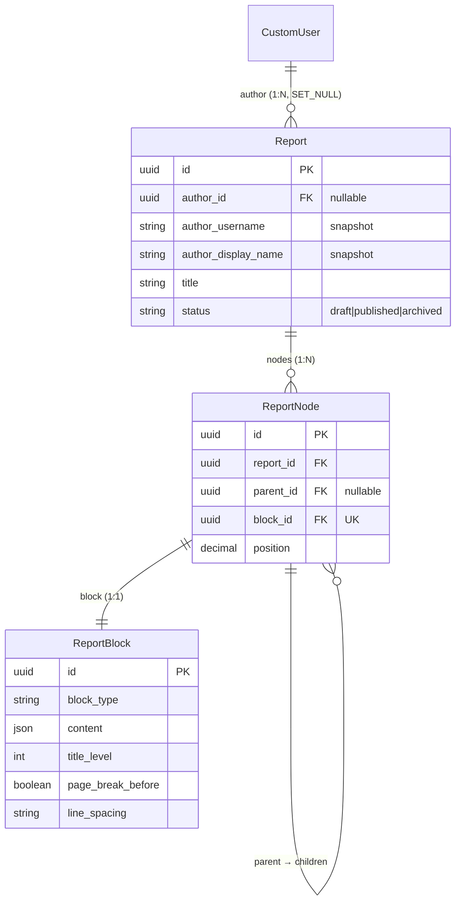

# App `reports` — Relatórios modulares

Composição de **relatórios genéricos** por árvore de nós e blocos de conteúdo
tipados. Base para laudos periciais e outros documentos produzidos no ReportLine.

> **Decisão:** [ADR-0002](../decisions/0002-report-node-structure.md)

---

## Propósito

| Aspecto | Descrição |
|---|---|
| **Problema** | Documentos periciais exigem seções aninhadas, tipos de conteúdo distintos e formatação consistente |
| **Solução** | `Report` + árvore `ReportNode` + bloco genérico `ReportBlock` 1:1 por nó |
| **Fora do escopo (fase atual)** | Editor web, renderização PDF, templates de laudo pericial específicos |
| **Consumidor futuro** | Camada de laudo pericial (mapeia papéis semânticos → blocos genéricos) |

---

## Estrutura do app

```
reports/
├── admin/
│   ├── report_admin.py
│   ├── report_block_admin.py
│   └── report_node_admin.py
├── forms/                         # reservado para telas de edição
├── models/
│   ├── report.py
│   ├── report_node.py
│   └── report_block.py
├── services/
│   └── author_snapshot.py         # snapshot textual do autor
├── signals.py                     # cascata nó→bloco; snapshot na exclusão do user
├── static/reports/
├── templates/reports/
├── tests/
│   ├── test_report_models.py
│   └── test_report_block.py
├── migrations/
│   └── 0001_initial.py
├── urls.py                        # app_name = "reports" (rotas a implementar)
└── views/                         # CBVs futuras
```

---

## Models

### `Report`

Relatório modular. Herda `BaseModel` (UUID + timestamps).

| Campo | Tipo | Descrição |
|---|---|---|
| `author` | FK → `CustomUser`, nullable | Autor; `SET_NULL` na exclusão da conta |
| `author_username` | CharField(150) | Snapshot do username |
| `author_display_name` | CharField(255) | Snapshot do nome exibido |
| `title` | CharField(255) | Título do relatório |
| `status` | CharField | `draft` \| `published` \| `archived` |

**Regras:**

- `save()` atualiza snapshot enquanto `author` estiver vinculado.
- Signal `pre_delete` em `CustomUser` reforça snapshot antes do `SET_NULL`.
- Property `author_label` retorna autor ativo ou snapshot.

### `ReportNode`

Nó na árvore de composição. Herda `BaseModel`.

| Campo | Tipo | Descrição |
|---|---|---|
| `report` | FK → `Report` | Relatório pai (`CASCADE`) |
| `parent` | FK → self, nullable | Pai na árvore; `null` = raiz |
| `block` | OneToOne → `ReportBlock` | Conteúdo renderizado pelo nó |
| `position` | DecimalField | Ordem entre irmãos (indexação fracionária) |

**Regras:**

- Índice `(report, parent, position)` para consultas de ordenação.
- Signal `post_delete` remove o `ReportBlock` associado (evita órfãos).

### `ReportBlock`

Bloco genérico de conteúdo. Herda `BaseModel`.

| Campo | Tipo | Descrição |
|---|---|---|
| `block_type` | CharField | Tipo de conteúdo (ver tabela abaixo) |
| `content` | JSONField | Payload específico do tipo |
| `title_level` | PositiveSmallIntegerField | Nível hierárquico do título (0–9); blocos `heading` |
| `page_break_before` | BooleanField | Quebrar página antes |
| `keep_with_previous` | BooleanField | Manter com bloco anterior |
| `keep_with_next` | BooleanField | Manter com bloco posterior |
| `indent_paragraph` | BooleanField | Identar parágrafo |
| `first_line_indent` | BooleanField | Recuar primeira linha |
| `line_spacing` | CharField | `compact` \| `normal` \| `relaxed` |
| `space_before` | PositiveSmallIntegerField | Espaço antes (pt) |
| `space_after` | PositiveSmallIntegerField | Espaço após (pt) |

#### Tipos de bloco (`ReportBlockType`)

| Valor | Descrição | Exemplo de `content` |
|---|---|---|
| `heading` | Título | `{"text": "Introdução"}` + `title_level` |
| `paragraph` | Parágrafo | `{"text": "Corpo do texto."}` |
| `link` | Link | `{"text": "Rótulo", "url": "https://..."}` |
| `ordered_list` | Lista numerada | `{"items": ["A", "B"]}` |
| `unordered_list` | Lista com marcadores | `{"items": ["A", "B"]}` |
| `table` | Tabela | `{"headers": [...], "rows": [...]}` |
| `image` | Imagem | `{"alt": "...", "file": "..."}` |

Opções de layout aplicam-se a **todos** os tipos; a interpretação visual fica
na camada de renderização (futura).

#### Exemplo futuro — número do laudo pericial

```python
ReportBlock(
    block_type=ReportBlockType.HEADING,
    title_level=0,
    content={"text": "123/2026"},
    position=...,  # via ReportNode
)
```

---

## Diagrama de relacionamentos



---

## Dependências

| Dependência | Motivo |
|---|---|
| `accounts.CustomUser` | Autor do relatório |
| `common.BaseModel` | UUID e timestamps |

Não depende de `profiles` nem `institution_ic_sp` no model layer; metadados
periciais podem ser enriquecidos na renderização via perfil do autor.

---

## Admin

Models registrados no Django Admin:

- `Report` — listagem com `author_label_display`
- `ReportNode` — árvore e posição
- `ReportBlock` — tipo, conteúdo e fieldset **Layout e paginação**

---

## Testes

| Arquivo | Cobertura |
|---|---|
| `test_report_models.py` | Report, ReportNode, snapshot do autor, cascata |
| `test_report_block.py` | Tipos de bloco, defaults de layout |

Executar: `python manage.py test reports`

---

## Próximos passos

- [ ] CBVs de listagem e edição de relatório
- [ ] Serviço de árvore (inserir, mover, reordenar nós)
- [ ] Validação de `content` por `block_type`
- [ ] Camada de laudo pericial (mapeamento semântico → blocos genéricos)
- [ ] Renderização PDF/HTML com opções de layout

---

## Referências

- [ADR-0002](../decisions/0002-report-node-structure.md)
- [Modelo de dados](./02-data-model.md)
- [Mapa de apps](./03-apps-map.md)
- [App profiles](./05-profiles.md)
