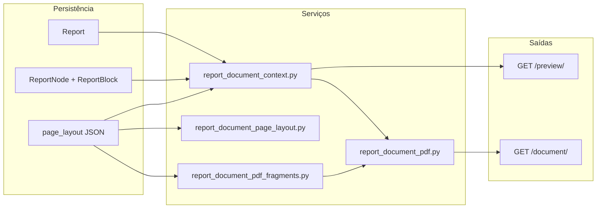

# Renderização de documento — HTML paginado e PDF

Pipeline de **visualização de leitura** e **exportação PDF** do laudo,
com HTML canônico compartilhado entre preview e PDF. Complementa [07-reports.md](./07-reports.md).

> **Status:** ✅ Fases 0–2 implementadas · 🟡 Fase 3 (KaTeX) pendente  
> **Runbook operacional:** [runbook_pdf.md](../runbook_pdf.md)

---

## Objetivo

| Meta | Descrição |
|---|---|
| **Pipeline único** | Contexto e blocos de leitura compartilhados entre preview e PDF |
| **Paridade visual** | Margens ABNT, tipografia e cabeçalho/rodapé alinhados entre modos |
| **Editor separado** | `/edit/` permanece `contenteditable` em scroll contínuo; paginação só na visualização |
| **Fórmulas depois** | KaTeX entra após o pipeline estável (modal no editor; render na leitura) |

---

## Arquitetura implementada



**Preview:** HTML autônomo (`report_document.html`) + paginação **client-side**
(`report_document_pagination.js`) com cabeçalho/rodapé clonados por folha.

**PDF:** HTML contínuo (`report_document_pdf.html`) + **Playwright/Chromium** com
`header_template` / `footer_template`; logos inlined como data URI.

**Motor PDF:** Playwright + Chromium. Alternativa descartada por ora: WeasyPrint.

---

## Rotas

| Rota | View | Name | Descrição |
|---|---|---|---|
| `GET /reports/<pk>/preview/` | `ReportDocumentPreviewView` | `reports:preview` | HTML paginado (leitura); autor only |
| `GET /reports/<pk>/document/` | `ReportDocumentPdfView` | `reports:document` | PDF inline; autor only |
| `GET /reports/<pk>/document/?html=1` | `ReportDocumentPdfView` | `reports:document` | HTML enviado ao Chromium (debug) |

Sem Playwright/Chromium instalado, `/document/` retorna **HTTP 503** com
`reports/document/unavailable.html`.

**Toolbar do editor:** links para preview (ícone olho) e PDF (ícone PDF), em nova aba.

---

## Mapa de arquivos

```
reports/
├── services/
│   ├── report_document_context.py       # build_report_document_context(), sections[]
│   ├── report_document_page_layout.py   # fragmentos read-only HF (preview)
│   ├── report_document_pdf_fragments.py # adapter page_layout → Playwright HF
│   └── report_document_pdf.py           # HTML PDF + render_report_document_pdf_bytes()
├── views/
│   └── report_document_views.py         # ReportDocumentPreviewView, ReportDocumentPdfView
├── templates/reports/
│   ├── document/
│   │   ├── report_document.html         # preview paginado (JS)
│   │   ├── report_document_pdf.html     # corpo contínuo (Playwright)
│   │   └── unavailable.html             # fallback 503
│   └── includes/
│       ├── report_document_block.html
│       ├── report_page_header_read.html
│       ├── report_page_footer_read.html
│       ├── report_page_header_pdf_fragment.html
│       └── report_page_footer_pdf_fragment.html
├── static/reports/
│   ├── css/report_document.css
│   └── js/report_document_pagination.js
└── tests/
    ├── test_report_document_context.py
    ├── test_report_document_views.py
    ├── test_report_document_page_layout.py
    ├── test_report_document_pdf_views.py
    └── test_report_page_layout_pdf_fragments.py

requirements-server.txt                  # playwright (além de requirements.txt)
docs/runbook_pdf.md                      # instalação Chromium em servidor
```

---

## Fases de implementação

| Fase | Status | Entrega |
|---|---|---|
| **0** | ✅ | Contexto de leitura, blocos read-only, rota `/preview/`, CSS inline |
| **1.1** | ✅ | `@page` ABNT (A4, margens 3/2/2/3 cm, Times 12pt, entrelinhas 1,5) |
| **1.2** | ✅ | Paginação JS no preview; cabeçalho/rodapé repetidos; numeração “Página N de T” |
| **2** | ✅ | Export PDF Playwright, rota `/document/`, toolbar, runbook, testes, 503 |
| **3** | 🟡 | Fórmulas (KaTeX) — modal no editor + render no pipeline |

### Detalhes por fase

**Fase 0 — Preview read-only**
- `build_report_document_context()` reutiliza `build_report_editor_context()`
- `ReportDocumentSection` com HTML sanitizado e URLs absolutas de mídia
- Template autônomo com CSS embutido (sem dependência de cache de estático externo)

**Fase 1.1 — CSS ABNT**
- `report_document.css`: `@page`, quebras de página, legendas/tabelas 10pt
- Preview em tela espelha margens via variáveis CSS

**Fase 1.2 — Paginação no preview**
- `report_document_pagination.js` distribui blocos em `.report-document-page-sheet`
- Header/footer clonados de `<template>`; numeração via `data-report-page-current/total`

**Fase 2 — PDF Playwright**
- `build_report_document_html()` — corpo contínuo sem script de paginação
- `build_playwright_header_template()` / `build_playwright_footer_template()`
- Numeração PDF: `<span class="pageNumber">` / `<span class="totalPages">`
- `ReportPdfUnavailable` → HTTP 503

---

## Contrato de `sections[]`

Cada item representa um bloco do corpo em ordem de leitura (`ReportDocumentSection`):

| Campo | Tipo | Descrição |
|---|---|---|
| `node_id` | UUID | Âncora `#report-block-{id}` |
| `block_type` | str | `heading`, `paragraph`, `table`, … |
| `body_html` | str | HTML sanitizado (`inline_text`) |
| `heading_number` | str | Numeração automática (se ativa) |
| `caption_number` | int | Legenda de imagem (se aplicável) |
| `figures` | list | Imagens com URL absoluta e dimensões |
| `content` | dict | Payload enriquecido (tabelas, imagens) |
| `text_align`, `indent_level`, `first_line_indent` | — | Paridade com editor |

Montagem via `build_report_editor_context()` + sanitização em
`report_document_context.py` (`report_table_cell_content`, numeração de títulos/legendas, etc.).

Campo **`needs_math`** (Fase 3): conteúdo com `data-latex` — ainda não implementado.

---

## Preview vs editor vs PDF

| Modo | URL | Paginação | Cabeçalho/rodapé | Editável |
|---|---|---|---|---|
| Editor | `/edit/` | Não (scroll contínuo) | Uma vez na folha | Sim |
| Preview | `/preview/` | Sim (JS client-side) | Repetidos por folha | Não |
| PDF | `/document/` | Sim (Playwright) | Repetidos via HF templates | Não |

O preview e o PDF usam o **mesmo contexto de blocos**, mas templates distintos:
preview pagina no navegador; PDF delega paginação ao Chromium.

---

## Dependências e operação

| Ambiente | Pacotes | Comportamento |
|---|---|---|
| Desenvolvimento | `requirements.txt` | Preview OK; PDF retorna 503 |
| Servidor | `requirements-server.txt` + `playwright install chromium` | Preview e PDF |

Ver [runbook_pdf.md](../runbook_pdf.md) para procedimento completo.

---

## Pendências e evoluções

| Item | Status |
|---|---|
| KaTeX (Fase 3) | 🟡 |
| Viewer PDF em iframe (`report_document_pdf_viewer.html`) | 🟡 opcional |
| `report_block_render.py` dedicado | 🟡 opcional (lógica hoje em `report_document_context.py`) |
| Anexos PDF merged (`pypdf`) | 🟡 fase posterior |
| Paridade pixel-perfect preview ↔ PDF | 🟡 validar quebras longas (tabelas, figuras) |

---

## Referências

- [07-reports.md](./07-reports.md) — editor e modelos
- [runbook_pdf.md](../runbook_pdf.md) — implantação Playwright
- [ADR-0002](../decisions/0002-report-node-structure.md) — árvore de nós
- [Playwright — page.pdf()](https://playwright.dev/python/docs/api/class-page#page-pdf)
