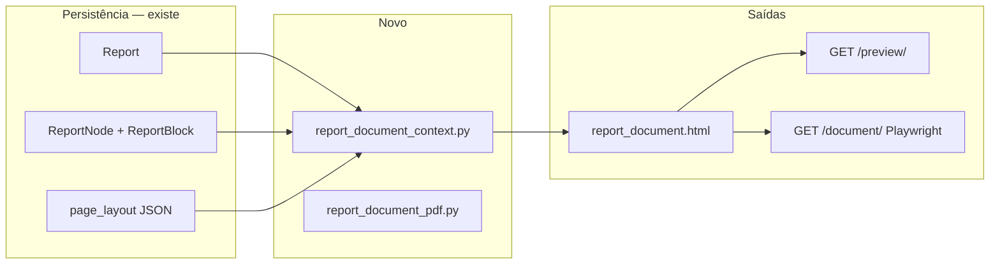

# Renderização de documento — HTML paginado e PDF

Planejamento da **visualização de leitura** e **exportação PDF** do laudo,
com pipeline único HTML → PDF. Complementa [07-reports.md](./07-reports.md).

> **Status:** 🟡 Planejado (não implementado).  
> **Referência de conceito:** pith (`modelo_conceito/pith/reports/services/pdf.py`) — adaptar, não copiar.

---

## Objetivo

| Meta | Descrição |
|---|---|
| **Pipeline único** | Um HTML canônico alimenta preview paginado e PDF |
| **Paridade visual** | Preview de leitura idêntico ao PDF (margens, quebras, cabeçalho/rodapé) |
| **Editor separado** | `/edit/` permanece `contenteditable` em scroll contínuo; paginação só na visualização |
| **Fórmulas depois** | KaTeX entra após o pipeline estável (modal no editor; render na leitura) |

---

## Arquitetura alvo



**Motor PDF proposto:** Playwright + Chromium (como no pith), com cabeçalho/rodapé via
`header_template` / `footer_template` e logos inlined como data URI.

**Alternativa descartada por ora:** WeasyPrint (menor footprint, validar paridade com tabelas/layout tabular depois).

---

## O que reaproveitar do pith

| Pith | ReportLine |
|---|---|
| `build_report_pdf_context()` | `build_report_document_context()` — a partir de `body_entries` |
| `build_report_pdf_html()` / `render_report_pdf_bytes()` | `build_report_document_html()` / `render_report_document_pdf_bytes()` |
| `report_body_sections.html` | `report_document_block.html` (evoluir `report_block_preview.html`) |
| `report_pdf.css` | `report_document.css` |
| CSS inline no HTML (`pdf_inline_styles`) | Evitar cache stale no Chromium headless |
| Fragmentos header/footer Playwright | Adapter de `Report.page_layout` (já no editor) |
| `?html=1` para debug | Mesma rota PDF com query string |
| KaTeX antes de `page.pdf()` | Fase posterior; usar `data-latex`, não delimitadores no texto |
| `ReportPdfUnavailable` → HTTP 503 | Tratamento quando Chromium ausente |

## O que não copiar do pith

- Toast UI / MathLive / Markdown (`rich-text-markdown-katex.js`)
- LaTeX como delimitadores visíveis (`\(...\)`, `$$`) no fluxo de edição
- `ReportDisplayView` contínuo como preview oficial (não pagina)
- Models `ReportHeader` / `ReportFooter` — ReportLine usa `page_layout` JSON
- Anexos PDF merged (`pypdf`) — fase posterior

---

## Mapa de arquivos (alvo)

```
reports/
├── services/
│   ├── report_document_context.py    # contexto de leitura (sections[])
│   ├── report_document_pdf.py          # HTML + Playwright + fragmentos HF
│   └── report_block_render.py          # opcional: bloco → HTML de leitura
├── views/
│   └── report_document_views.py        # preview + pdf + ?html=1
├── templates/reports/
│   ├── document/
│   │   ├── report_document.html
│   │   ├── report_document_pdf_viewer.html   # opcional (iframe)
│   │   └── unavailable.html
│   └── includes/
│       ├── report_document_block.html        # evolui report_block_preview.html
│       ├── report_page_header_read.html
│       └── report_page_footer_read.html
├── static/reports/css/
│   └── report_document.css
└── tests/
    ├── test_report_document_context.py
    ├── test_report_document_pdf_views.py
    └── test_report_page_layout_pdf_fragments.py
```

### Rotas propostas

| Rota | View | Descrição |
|---|---|---|
| `GET /reports/<pk>/preview/` | `ReportDocumentPreviewView` | HTML paginado (leitura) |
| `GET /reports/<pk>/document/` | `ReportDocumentPdfView` | PDF inline ou download |
| `GET /reports/<pk>/document/?html=1` | idem | HTML enviado ao Chromium (debug) |

---

## Ordem cronológica de implementação

| Fase | Entrega | Arquivos principais |
|---|---|---|
| **0** | Contexto + template contínuo (sem paginação) | `report_document_context.py`, `report_document_block.html`, rota `/preview/` |
| **1** | Paginação + cabeçalho/rodapé repetidos | `report_document_pdf.py`, adapter `page_layout`, `report_document.css` |
| **2** | Export PDF (Playwright) | view PDF, toolbar, `requirements-server.txt`, `docs/runbook_pdf.md` |
| **3** | Fórmulas (KaTeX) | modal editor + render no pipeline; **depois** das fases 0–2 |

---

## Contrato de `sections[]` (rascunho)

Cada item representa um bloco do corpo em ordem de leitura:

| Campo | Tipo | Descrição |
|---|---|---|
| `node_id` | UUID (str) | Âncora `#report-block-{id}` |
| `block_type` | str | `heading`, `paragraph`, `table`, … |
| `body_html` | str | HTML sanitizado (`inline_text`) |
| `heading_number` | str | Numeração automática (se ativa) |
| `caption_number` | int | Legenda de imagem (se aplicável) |
| `figures` | list | Imagens com URL absoluta e largura |
| `needs_math` | bool | Fase 3 — conteúdo com `data-latex` |

Montagem inicial reutiliza `build_report_editor_context()` e enriquecimento já existente
(`report_table_cell_content`, `report_caption_numbering`, etc.).

---

## Preview vs editor

| Modo | URL | Paginação | Editável |
|---|---|---|---|
| Editor | `/edit/` | Não (scroll contínuo) | Sim |
| Preview | `/preview/` | Sim | Não |
| PDF | `/document/` | Sim (Playwright) | Não |

---

## Referências

- [07-reports.md](./07-reports.md) — editor e modelos atuais
- [ADR-0002](../decisions/0002-report-node-structure.md) — árvore de nós
- pith: `reports/services/pdf.py`, `docs/runbook_pdf.md` (material de consulta local)
