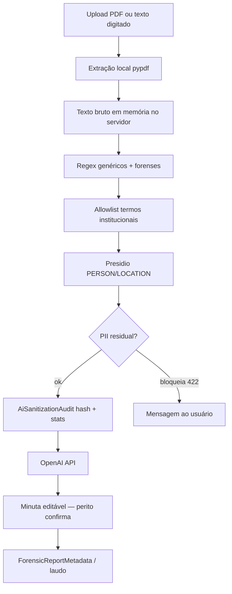

# Laudo pericial — IA externa e privacidade (PII)

Fluxo de **sanitização local** antes do envio de conteúdo à OpenAI, auditoria
e controles por perfil do perito.

> **Decisão:** [ADR-0008](../decisions/0008-ai-pii-sanitization.md)

---

## Propósito

| Aspecto | Descrição |
|---|---|
| **Problema** | Documentos periciais contêm PII; APIs externas não podem receber texto bruto |
| **Solução** | Pipeline local (regex + Presidio) + gateway único + auditoria por hash |
| **Princípio** | O que cruza para a OpenAI **não é o arquivo original** — é texto derivado e anonimizado |
| **Exceção** | Fotografias do local podem ir à API **somente** com permissão explícita no perfil do perito |

---

## Quem precisa de Python?

| Papel | Python / deps no servidor? |
|---|---|
| Perito no navegador | **Não** |
| Máquina que **hospeda** o ReportLine | **Sim** (`requirements.txt` + modelo spaCy) |

---

## Fluxo de dados



### Pontos de integração atuais

| Operação | Serviço | Gateway |
|---|---|---|
| Extração administrativa (intake / bootstrap) | `metadata_inference` | `complete_json_chat_safe` |
| Exame de local (fluxo 2) | `scene_examination_inference` | `complete_json_with_images_safe` |

---

## Estrutura no código

```
common/privacy/
  services/
    text_sanitizer.py       # pipeline base (regex + Presidio opcional)
    regex_patterns.py       # CPF, e-mail, telefone, CEP
    sanitization_allowlist.py  # utilitários de intervalos protegidos
    analyzer_registry.py    # Presidio/spaCy lazy (1× por worker)
    audit.py                # grava AiSanitizationAudit

common/models/
  ai_sanitization_audit.py

institution_ic_sp/forensic_report/common/ai/
  gateway.py                # único ponto de saída OpenAI
  document_text.py          # extração PDF (pypdf)
  sanitization/
    forensic_patterns.py    # BO, IP, placa, protocolo…
    forensic_sanitizer.py   # orquestra pipeline forense
    sanitization_allowlist.py  # lista padrão + settings
```

---

## Allowlist (termos preservados)

Evita que rótulos institucionais sejam removidos pelo Presidio como `PERSON`.

**Padrão incluído (exemplos):**

- Autoridade Requisitante
- fotógrafo / fotógrafo técnico
- croqui, desenho, desenhista
- perito criminal, escaneamento 3D
- requisição de exame pericial, objetivo da perícia

**Estender via `.env`:**

```env
FORENSIC_AI_SANITIZATION_ALLOWLIST=termo customizado,outro termo
```

**Editar lista canônica:** `sanitization_allowlist.py` →
`DEFAULT_FORENSIC_SANITIZATION_ALLOWLIST`.

> A allowlist **não desativa** regex de CPF, BO ou placa — números sensíveis
> continuam sendo substituídos.

---

## Permissão de imagens à IA externa

Campo no perfil do perito ([05-profiles.md](./05-profiles.md)):

| Campo | Default | Admin |
|---|---|---|
| `can_send_images_to_external_ai` | `False` | Seção *Integração com IA* |

- Com permissão **desligada** e `image_ids` no POST → **403**.
- Com permissão **ligada** → imagens em base64 na chamada multimodal; **texto**
  do prompt continua sanitizado.

---

## Variáveis de ambiente

| Variável | Default | Descrição |
|---|---|---|
| `OPENAI_API_KEY` | — | Chave OpenAI; vazio = IA desabilitada |
| `FORENSIC_AI_MODEL` | `gpt-4o-mini` | Modelo de chat |
| `FORENSIC_AI_SANITIZATION_ENABLED` | `true` | Desliga pipeline (somente dev controlado) |
| `FORENSIC_AI_BLOCK_ON_RESIDUAL_PII` | `true` | Bloqueia envio se PII residual detectado |
| `PRESIDIO_SPACY_MODEL` | `pt_core_news_lg` | Modelo spaCy para Presidio |
| `FORENSIC_AI_SANITIZATION_ALLOWLIST` | — | Termos extras separados por vírgula |

Ver `.env.example` na raiz do projeto.

---

## Setup do servidor (IA + sanitização)

Após `pip install -r requirements.txt`:

```bash
python -m spacy download pt_core_news_lg
python manage.py migrate
```

**Dependências relevantes** (`requirements.txt`):

- `presidio-analyzer`, `presidio-anonymizer` (2.2.364)
- `cryptography` (48.0.1 — compatível com Presidio)
- `spacy` (3.8.7)
- `openai`, `pypdf`

Se o modelo spaCy não estiver instalado, o sistema **continua funcionando**
apenas com regex; um aviso é registrado no log.

---

## Auditoria (`AiSanitizationAudit`)

Registro em `common` — **sem conteúdo bruto**:

| Campo | Uso |
|---|---|
| `operation` | ex.: `metadata_extraction`, `scene_examination` |
| `content_hash` | SHA-256 do texto **antes** da sanitização |
| `replacement_counts` | Contagem por tipo (CPF, BO, PRESIDIO…) |
| `blocked` | Se o envio foi impedido |
| `user`, `report` | Contexto opcional |

---

## Respostas HTTP ao usuário

| Situação | Código | Comportamento |
|---|---|---|
| PII residual após sanitização | 422 | Mensagem em português; perito preenche manualmente |
| Imagens sem permissão no perfil | 403 | Orientação para solicitar habilitação ao admin |
| OpenAI não configurada | 200 + warnings | Montagem com dados disponíveis |

---

## Human-in-the-loop

1. IA retorna JSON/texto como **sugestão**.
2. Merge **manual > IA** (`metadata_merge`).
3. Modais de confirmação no bootstrap (tipo de exame, características do local).
4. Dados confirmados vão para `ForensicReportMetadata` e blocos do laudo.

---

## Dossiê pericial (`ForensicReportMetadata`)

Metadados confirmados por fase (`initial_data`, `property_crime`, …) em
`institution_ic_sp` — fonte de verdade após confirmação do perito. Detalhes
de implementação no código em `forensic_report/services/forensic_report_dossier.py`.

---

## Referências

- [ADR-0008](../decisions/0008-ai-pii-sanitization.md)
- [ADR-0005](../decisions/0005-external-api-credentials.md)
- [05-profiles.md](./05-profiles.md)
- [01-context.md](./01-context.md)
- [03-apps-map.md](./03-apps-map.md)
